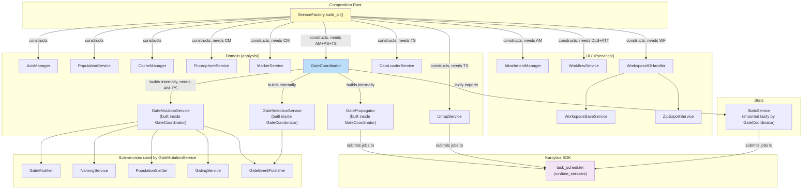

# Services & Dependency Injection

This document explains how the flow cytometry plugin wires its services together, and documents each service's responsibility, key methods, and dependency relationships. Every claim here is grounded in the actual source under `src/karcytics_plugins/flow_cytometry/`; where a service's true wiring differs from what a "typical" DI setup would lead you to expect, that's called out explicitly.

## 1. The composition root

There is exactly one wiring point: `ServiceFactory` in `ui/composition_root.py`.

```python
class ServiceFactory:
    def __init__(self, state: FlowState, parent_widget: Any | None = None):
        self.state = state
        self.parent_widget = parent_widget
        self._services: dict = {}

    def build_all(self) -> None: ...
    def get(self, service_name: str) -> Any: ...
```

`FlowCytometryPanel` (`ui/main_panel.py`) constructs one `ServiceFactory` per panel instance, calls `build_all()` once, then pulls out the handles it needs by string key:

```python
self._factory = ServiceFactory(self.state, self)
self._factory.build_all()

self._gate_coordinator = self._factory.get("gate_coordinator")
self._gate_controller = self._gate_coordinator  # same object, two names
self._gate_propagator = self._factory.get("gate_propagator")
self._workflow_service = self._factory.get("workflow_service")
self._umap_service = self._factory.get("umap_service")
self._fluor_service = self._factory.get("fluor_service")
self._workspace_io_handler = self._factory.get("workspace_io_handler")
```

`data_loader_service` is also fetched later, on demand, from `_factory.get("data_loader_service")` rather than cached as an attribute at setup time.

!!! note "This is a service locator, not a container with reflection"
    `ServiceFactory` does not do constructor-signature introspection, decorator-based registration, or interface binding. `build_all()` is one long, explicitly ordered function that imports each service module, instantiates it by hand with the dependencies it needs (already-built earlier in the same function), and stashes the result in a plain `dict`. `get()` is just `dict.get`. This is intentional and matches the file's own docstring — "centralizes the instantiation and wiring of all domain and infrastructure services, adhering to the Dependency Inversion Principle" — the point is a **single, auditable place** where every service's dependency graph is visible top-to-bottom in one function, not a generic DI framework.

### Why this shape

- **One entry point per panel lifetime.** `FlowCytometryPanel` owns one `ServiceFactory`, and `build_all()` runs once at panel construction. There's no re-wiring mid-session — services live as long as the panel.
- **Explicit ordering encodes the real dependency graph.** Because `build_all()` is a straight-line function, a service can only depend on something constructed *earlier in the same function* — Python would raise `NameError` otherwise. Reading top-to-bottom top of `build_all()` to bottom **is** reading the dependency graph.
- **String-keyed lookup keeps `FlowCytometryPanel` decoupled from construction details.** The panel doesn't know or care how `gate_coordinator` was built, what it needed, or in what order — it just asks for it by name after `build_all()` returns.
- **The `[phase1]` log breadcrumbs are deliberate diagnostic instrumentation**, not leftover debug code — the module docstring/comment explains they exist to pinpoint exactly which service construction step a stalled daemon subprocess never got past, because `.warning()` is the lowest log level guaranteed visible in captured stderr without a configured handler.

### `build_all()` construction order (as written)

1. Import `task_scheduler` from `karcytics_sdk.plugin.runtime_services` (a shared, SDK-provided singleton — not constructed here).
2. Import all service modules.
3. Build stateless domain services first: `AxisManager(state)`, `PopulationService(state)` — both stashed directly onto `state` (`state.axis_manager`, `state.population_service`) **in addition to** the factory's own registry.
4. Build the biology cache stack: `CacheManager(cache_dir)` (cache dir: `~/.karcytics/cache/biology`), then `FluorophoreService(cache_manager)` and `MarkerService(cache_manager)`.
5. Build `GateCoordinator(state, axis_manager, population_service, task_scheduler)` — depends on steps 3 (via `axis_manager`/`population_service`) and the SDK `task_scheduler` from step 1.
6. Build the analysis/computation services: `DataLoaderService(task_scheduler)`, `AttachmentManager(axis_manager)`, `WorkflowService(state, data_loader_service, attachment_manager)`, `UmapService(state, task_scheduler)`.
7. Build the UI-facing IO service: `WorkspaceIOHandler(workflow_service=workflow_service, parent_widget=self.parent_widget)`.
8. Register everything into `self._services` under 11 keys (see table below) — note `gate_propagator` is registered as `gate_coordinator.propagator`, i.e. it is **not** constructed independently; `GateCoordinator.__init__` builds its own `GatePropagator` internally and the factory just re-exposes it.

### Registered service keys

| Key | Type | Constructed as |
|---|---|---|
| `axis_manager` | `AxisManager` | `AxisManager(state)` |
| `population_service` | `PopulationService` | `PopulationService(state)` |
| `cache_manager` | `CacheManager` | `CacheManager(cache_dir)` |
| `fluor_service` | `FluorophoreService` | `FluorophoreService(cache_manager)` |
| `marker_service` | `MarkerService` | `MarkerService(cache_manager)` |
| `gate_coordinator` | `GateCoordinator` | `GateCoordinator(state, axis_manager, population_service, task_scheduler)` |
| `gate_propagator` | `GatePropagator` | `gate_coordinator.propagator` (built *inside* `GateCoordinator.__init__`, not independently) |
| `workflow_service` | `WorkflowService` | `WorkflowService(state, data_loader_service, attachment_manager)` |
| `umap_service` | `UmapService` | `UmapService(state, task_scheduler)` |
| `data_loader_service` | `DataLoaderService` | `DataLoaderService(task_scheduler)` |
| `workspace_io_handler` | `WorkspaceIOHandler` | `WorkspaceIOHandler(workflow_service=workflow_service, parent_widget=parent_widget)` |

`marker_service` and `data_loader_service` are registered but not pulled into a `FlowCytometryPanel` attribute at setup time in the snippet above — `data_loader_service` is fetched lazily later; `marker_service` is available via `factory.get("marker_service")` wherever the factory itself is reachable.

Two services constructed inside `ServiceFactory.build_all()` are **not** registered in `self._services` at all and have no factory key: `AttachmentManager` and the biology `cache_manager`'s consumers work only through the objects that already hold references to them (`WorkflowService` holds `attachment_manager`; `fluor_service`/`marker_service` hold `cache_manager`). If you need `AttachmentManager` directly, get it via `factory.get("workflow_service")._attachment_manager` (private) rather than the factory — there's no public accessor.

---

## 2. Service dependency graph



---

## 3. `ui/services/` — persistence and IO

### `AttachmentManager` — `ui/services/attachment_manager.py`

**Responsibility:** persists binary attachments (currently: UMAP embeddings, indices, and cluster arrays) alongside a saved workflow, separate from the JSON-serializable workflow payload.

```python
class AttachmentManager:
    def __init__(self, axis_manager): ...
    def serialize_attachments(self, state, context) -> dict
    def hydrate_attachments(self, meta_dict, state, context) -> None
    def serialize_umap_results(self, umap_results: dict, context) -> dict
    def hydrate_umap_results(self, meta_dict: dict, state, context) -> dict
```

Depends on `AxisManager` — needed by `_reconstruct_intensities` to re-derive each channel's biexponential (logicle) transform parameters when rehydrating a UMAP run's marker intensities from disk. Numpy arrays are written to/read from `tempfile.gettempdir()` as `.npy` files keyed by generated `emb_key`/`idx_key`/`cls_key` identifiers; the `context` object (an SDK `WorkflowContext`) is what actually persists those temp files into the project's attachment store or a zip. `hydrate_attachments`/`serialize_attachments` are the generic entry points — other attachment types would be registered by extending these two methods (currently only `umap_results` is handled).

**Depended on by:** `WorkflowService` (constructor param).

### `WorkflowService` — `ui/services/workflow_service.py`

**Responsibility:** the QObject that owns save/load of the full flow-cytometry workflow — serializes `FlowState` (experiment tree, compensation, view state) to a dict and back, and orchestrates the async FCS-data reload that must happen after an experiment is deserialized (gate trees can be restored from JSON, but event data has to be re-read from the original `.fcs` files on disk).

```python
class WorkflowService(QObject):
    def __init__(self, state: FlowState, data_loader_service, attachment_manager, parent=None): ...
    def export_workflow(self, context=None, project_dir: Path | None = None) -> dict
    def load_workflow(self, payload: dict, context=None, on_complete=None, project_dir: Path | None = None, **kwargs) -> bool
    def reload_fcs_data(self, sample_paths: dict[str, str], project_dir: Path | None = None, on_complete=None) -> None
```

Depends on `DataLoaderService` (for `reload_samples_batch`, invoked via `reload_fcs_data`) and `AttachmentManager` (for binary payload hydration/serialization). In `__init__` it reaches into `data_loader_service._scheduler` (a private attribute — this is a real coupling, not accidental: `WorkflowService` needs the same `TaskScheduler` to know when its own submitted `FunctionalTask` for FCS reload has finished) and connects to `scheduler.task_finished`.

**Depended on by:** `WorkspaceIOHandler` (passed into `WorkspaceSaveService`/`ZipExportService` static methods), `WorkspaceSaveService`, `ZipExportService`.

### `WorkspaceIOHandler` — `ui/services/workspace_io_handler.py`

**Responsibility:** the top-level "Save"/"Update"/"Load" UI orchestration — decides whether a Karcytics `ProjectManager` is available (project-backed save/load via `WorkspaceSaveService`) or falls back to a standalone `.zip` file (`ZipExportService`), drives the file dialogs, and submits everything as an SDK `FunctionalTask` so the UI thread never blocks on IO.

```python
class WorkspaceIOHandler:
    def __init__(self, workflow_service, parent_widget: Any): ...
    def handle_save(self) -> None
    def handle_update(self) -> None
    def handle_load(self) -> None
```

Depends on `WorkflowService` (constructor param) and, at call time, reaches for `parent_widget.window().project_manager` (an SDK `ProjectManager`, not itself a service the factory builds). Also imports `WorkspaceSaveService` and `ZipExportService` directly (not injected).

**Depended on by:** nothing else in the service graph — it's a leaf, called only from `FlowCytometryPanel`'s save/load menu actions.

### `WorkspaceSaveService` — `ui/services/workspace_save_service.py`

**Responsibility:** pure delegation to the Karcytics SDK's `ProjectManager` — two static methods, `save_to_pm` and `load_from_pm`, that wrap a `WorkflowContext`, call `workflow_service.export_workflow`/`load_workflow`, and drive `pm.save_workflow` / `pm.attach_workflow_file` / `pm.load_workflow_payload`. Stateless; not constructed by the factory (it's a static-method utility class, imported directly where needed).

### `ZipExportService` — `ui/services/zip_export_service.py`

**Responsibility:** the standalone (no `ProjectManager`) persistence path — packs `workflow.json` plus any attachment files into a `.zip`, or extracts one back out to `~/.karcytics/workflows/<stem>/` for loading. Also stateless static methods, not factory-registered.

---

## 4. `analysis/services/` — domain operations

### `DataLoaderService` — `analysis/services/data_loader_service.py`

**Responsibility:** all FCS ingestion and re-application of compensation on reload.

```python
class DataLoaderService:
    def __init__(self, scheduler: object | None = None, plugin_id: str = "flow_cytometry"): ...
    def reload_sample(self, sample, path, compensation_matrix=None) -> bool
    def reload_samples_batch(self, samples_with_paths, compensation_matrix=None) -> dict[str, list[str]]
    def load_samples_async(self, paths, state, on_done, on_error_cb, on_progress=None, project_manager=None, copy_all=False) -> None
```

Depends on the SDK `task_scheduler` (submits an `FCSLoaderAnalysis` worker for `load_samples_async`) and on `analysis/compensation.py` (`apply_compensation`) and `analysis/fcs_io.py` (`load_fcs`, `load_fcs_batch`) directly (module-level imports, not injected).

**Depended on by:** `WorkflowService` (constructor param, used for post-load FCS reload), `ServiceFactory` itself (fetched lazily by `main_panel.py`).

!!! warning "One IPC lock serializes all single-file reloads"
    `reload_samples_batch` exists specifically because `reload_sample()` → `load_fcs()` serializes through a single process-wide daemon IPC lock (`_daemon_lock` in `fcs_io.py`). Calling `reload_sample()` per-sample from a thread pool does **not** parallelize — it collapses into one file at a time, and one slow file blocks every other sample behind it for up to its full IPC timeout. Always prefer `reload_samples_batch` for multi-sample reloads.

### `GateEventPublisher` — `analysis/services/gate_event_publisher.py`

**Responsibility:** the single choke point for every gating-related `CentralEventBus.publish()` call — decouples domain mutation code from the SDK's event-bus messaging concern. Pure static methods (`publish_gate_created`, `publish_gates_created`, `publish_gate_deleted`, `publish_gate_renamed`, `publish_gate_modified`, `publish_gate_selected`, `publish_stats_computed`) — stateless, not factory-registered, imported directly wherever needed.

**Depended on by:** `GateMutationService`, `GateSelectionService`, `GateCoordinator._on_stats_finished`.

### `GateMutationService` — `analysis/services/gate_mutation_service.py`

**Responsibility:** the actual domain-model edits to the `GateNode` tree — add/remove/rename/modify/split populations, wire/unwire logic-node connections. Every mutation that changes a population's evaluated membership also triggers `coordinator.recompute_all_stats(sample_id)` and (except for pure renames) `coordinator.request_propagation(...)`.

```python
class GateMutationService:
    def __init__(self, state, coordinator, selection_service, axis_manager, population_service): ...
```

Depends on: `FlowState`, the owning `GateCoordinator` (as `coordinator`, used only to call back into `recompute_all_stats`/`request_propagation` — this is the one place the sub-service holds a reference back to its facade), `GateSelectionService`, `AxisManager` (to snapshot `creation_view` — the axis scales in effect when a gate was drawn, so a saved pipeline thumbnail can reconstruct the original view), `PopulationService`. Internally also uses `NamingService`, `GatingService`, `GateModifier`, `PopulationSplitter`, `GateEventPublisher` (all imported directly, not injected).

**Depended on by:** `GateCoordinator` (constructs and owns one instance).

### `GateSelectionService` — `analysis/services/gate_selection_service.py`

**Responsibility:** tracks which population node is currently selected (`state.view.current_gate_id`) and publishes `GATE_SELECTED` on change — a single method, `select_gate(sample_id, node_id)`, that no-ops if the id is unchanged.

```python
class GateSelectionService:
    def __init__(self, state: FlowState, coordinator): ...
```

Depends on `FlowState` and holds a reference to the owning `coordinator` (unused directly in the current implementation beyond storage — `select_gate` reads/writes `self._state.view.current_gate_id` and calls `GateEventPublisher` directly).

**Depended on by:** `GateCoordinator` (constructs and owns one instance), `GateMutationService` (calls `select_gate` after adding a gate, to auto-select the newly created population).

### `GatingService` — `analysis/services/gating_service.py`

**Responsibility:** cross-sample gate-tree operations that don't belong to a single population's mutation — cloning a full DAG onto another sample (`clone_gate_tree`), and copying a gate tree to every sample sharing a group (`copy_gates_to_group`). Static methods; stateless.

```python
class GatingService:
    @staticmethod
    def get_gates_for_display(sample, parent_node_id=None) -> tuple[list[Gate], list[GateNode]]
    @staticmethod
    def clone_gate_tree(source_root: GateNode, target: Sample) -> None
    @staticmethod
    def copy_gates_to_group(experiment: Experiment, source_sample_id: str) -> int
```

**Depended on by:** `GateMutationService` (`copy_gates_to_group`, `get_gates_for_display`).

### `GateModifier` — `analysis/services/modifier.py`

**Responsibility:** validated in-place mutation of a gate's geometric parameters (`x_min`/`x_max`, `vertices`, `width`/`height`, etc.) — see [01_API_REFERENCE.md](01_API_REFERENCE.md) for the per-type invariant table. Static, stateless.

**Depended on by:** `GateMutationService` (`modify_gate`).

### `NamingService` — `analysis/services/naming.py`

**Responsibility:** generates a unique population display name (`"Gate 1"`, `"Gate 2"`, ...) that doesn't collide with existing node names in a sample's tree. Static, stateless.

**Depended on by:** `GateMutationService` (`generate_unique_name`, used when `add_gate` is called without an explicit `name`).

### `PopulationSplitter` — `analysis/services/splitter.py`

**Responsibility:** creates the "Inside"/"Outside" sibling population for a node — a second `GateNode` sharing the same `Gate` instance with `negated` flipped, wired to all of the original's parents. Static, stateless.

**Depended on by:** `GateMutationService` (`split_population`).

### `StatsService` — `analysis/services/stats_service.py`

**Responsibility:** submits a `StatisticsAnalysis` job to the SDK `task_scheduler` to recompute every population's count/%parent/%total for a sample, and wires up a one-shot callback when it finishes.

```python
class StatsService:
    @staticmethod
    def recompute_all_stats(state: FlowState, sample_id: str, callback: Callable | None = None) -> str | None
```

Depends on the SDK `task_scheduler` directly (module-level import from `karcytics_sdk.plugin.runtime_services`, not passed in) — this is the **one** analysis service that does not go through `ServiceFactory` at all: `GateCoordinator.recompute_all_stats` imports `StatsService` lazily, inline, at call time, rather than the factory constructing and registering an instance. There is no `stats_service` key in `ServiceFactory._services`.

**Depended on by:** `GateCoordinator.recompute_all_stats` (lazy import, not constructor injection).

### `UmapService` / `UmapParams` — `analysis/services/umap_service.py`

**Responsibility:** a facade over `TaskScheduler` for background UMAP dimensionality-reduction jobs (`UmapAnalysis` worker) — cancels any in-flight run before submitting a new one, so only one UMAP job runs per `UmapService` instance at a time.

```python
class UmapService:
    def __init__(self, state: FlowState, scheduler: Any): ...
    def run_analysis(self, params: UmapParams, on_done, on_error_cb, on_progress=None) -> None
    def cancel(self) -> None
```

Depends on the SDK `task_scheduler` (constructor param, from `ServiceFactory.build_all()`).

**Depended on by:** `main_panel.py` (`self._umap_service`).

---

## 5. Central domain objects also built by `ServiceFactory`

| Service | File | Responsibility |
|---|---|---|
| `GateCoordinator` | `analysis/gate_coordinator.py` | Top-level gate-lifecycle facade — see [01_API_REFERENCE.md §5](01_API_REFERENCE.md#5-gatecoordinator--analysisgate_coordinatorpy). Exposed on `main_panel.py` as both `self._gate_coordinator` and `self._gate_controller` (same object). |
| `AxisManager` | `analysis/axis_manager.py` | Per-group channel scale storage + auto-range calculation. See [01_API_REFERENCE.md §6](01_API_REFERENCE.md#axismanager--analysisaxis_managerpy). |
| `PopulationService` | `analysis/population_service.py` | Sample/node lookup and population add/remove — the lower-level model-manipulation layer that `GateMutationService` builds on. |
| `FluorophoreService` / `MarkerService` | `analysis/biology_services.py` | External biology lookups: `FluorophoreService` queries FPbase's GraphQL API for fluorophore spectra (with local disk caching via `CacheManager`); `MarkerService` queries UniProt for CD-marker/protein metadata, falling back to a stub record if the network call fails or returns nothing. |

`GatePropagator` (`analysis/gate_propagator.py`) is documented separately here because, while central, it is **not independently constructed** by the factory — see §1 above. Its responsibility: debounced (200ms) re-application of a source sample's full gate tree to every other sample in scope (active group, or all samples, or explicit cross-group), run on the background `TaskScheduler` via `_PropagationWorker`, publishing `SAMPLE_UPDATED` per sample and `PROPAGATION_COMPLETE` once all targets finish. One bad sample's propagation failure is isolated and reported in `PROPAGATION_COMPLETE`'s `errors` dict rather than aborting the batch.
