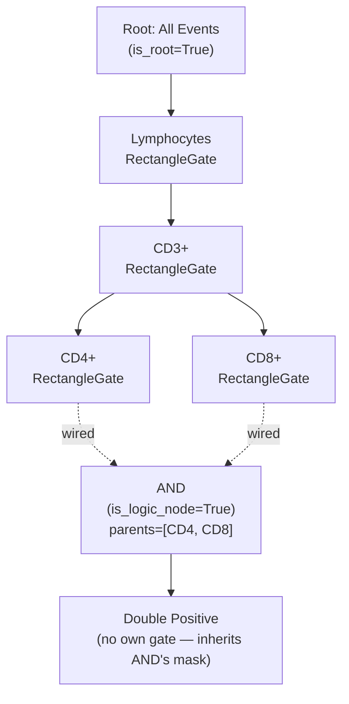
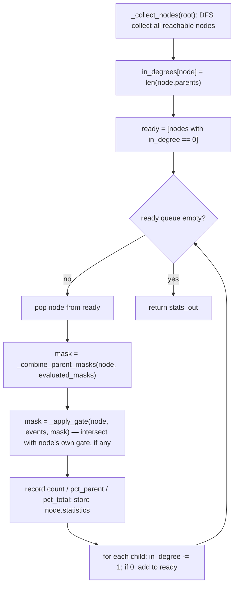
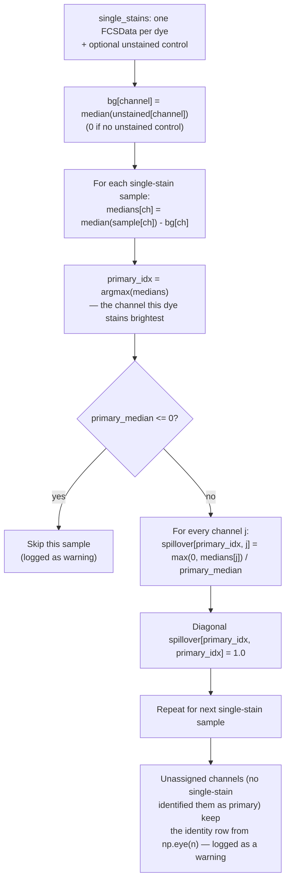

# Gating & Compensation Deep Dive

This document explains **how the math and data model actually work**: the boolean gating DAG and its evaluation algorithm, the coordinate-space subtlety every gate's `contains()` implementation has to handle, and the compensation algorithm end to end (spillover-matrix computation, extraction, and application). It is the mechanism-level companion to [01_API_REFERENCE.md](01_API_REFERENCE.md), which documents the call signatures; this document explains why they work the way they do.

---

## Part 1 — Gate evaluation

### 1.1 The population model is a DAG, not a tree

Every sample owns one `GateNode` tree rooted at a sentinel "All Events" node (`sample.gate_tree`). Most populations are simple single-parent nodes — the intuitive gating hierarchy. But `GateNode.logic_operator` (`"AND"` / `"OR"` / `"NOT"`) plus `GateNode.parents: list[GateNode]` (plural) means a node can have **more than one parent**, making the structure a DAG, not a strict tree. This is what `analysis/gating/__init__.py`'s own docstring — "models, hierarchy, and factory" — is describing, and it's why serialization (`GateNode.to_dict()`/`from_dict()`) uses a **flat node list with explicit parent-id references**, not a nested JSON tree: a nested representation cannot express a node with two parents without duplicating it.

Two structural flags disambiguate node roles that would otherwise be ambiguous from shape alone:

- **`is_root`** (property): `True` only for the single sentinel root — `gate is None and not parents and not is_logic_node`.
- **`is_logic_node`** (field): `True` for AND/OR/NOT nodes. Needed because a **freshly created, unwired** logic node also has `gate is None` and `parents == []` — structurally indistinguishable from the root without this explicit flag. `GateNode.is_root` checks `not self.is_logic_node` specifically to avoid this collision.
- **`is_incomplete`** (property): `True` for a logic node that doesn't yet have enough *real* (non-root) parents wired in to be evaluated — `< 1` for `NOT`, `< LOGIC_GATE_MIN_PARENTS` (2) for `AND`/`OR`. Always `False` for non-logic nodes.



### 1.2 Wiring a logic node: `add_connection` / `remove_connection`

`add_logic_node(sample_id, operator, name=None)` (`GateMutationService`) creates a `GateNode` with **no parents** and does *not* attach it as a child of root in the normal sense — the comment in the source is explicit about why: attaching it directly to root and then hiding the root→logic edge in the canvas caused an "orphaned visual" bug. Instead the node is appended to `sample.gate_tree.children` (so `find_node_by_id` and the stats walker can still discover it) while its `.parents` list stays empty until the user drags real gate nodes onto it via `add_connection`.

`add_connection(sample_id, source_node_id, target_node_id)`:

1. Rejects if either node is missing.
2. Rejects wiring **into the root** (`target is sample.gate_tree`).
3. Rejects if it would create a **cycle** (`target.find_node_by_id(source_node_id)` — if the source is reachable *below* the target, wiring source→target would loop).
4. Adds the edge both ways (`target.parents.append(source)`, `source.children.append(target)`).
5. Once the logic node has **more than one** real parent, the root sentinel is dropped from its `parents` list (it may have been added by `remove_connection`'s "reattach to root" fallback below) — but the node stays in `root.children` regardless, since that list is what the stats walker uses to discover reachable logic nodes; only the *visual* root→logic edge is suppressed, and only in the canvas layer.
6. If the node is now fully wired (`not target.is_incomplete`), triggers `coordinator.recompute_all_stats(sample_id)` and publishes `GATE_STATS_UPDATED`. If still under-wired, it publishes the raw topic string `"flow.pipeline.connection_added"` instead — a cheap "just draw the wire" signal that deliberately skips the expensive full recompute + canvas refresh.

`remove_connection` is the inverse: unwires both directions, and if the target is left with **zero** parents, re-parents it onto the root sentinel (so it doesn't become unreachable) — guarding against double-appending it to `root.children` if it's already there. If removal leaves the node `is_incomplete` and it's a logic node, its statistics are explicitly zeroed (`count=0, pct_parent=0.0, pct_total=0.0, per_parent_pcts={}`) rather than left stale.

### 1.3 Mask combination — `AND` / `OR` / `NOT`

Both `DagEvaluator._combine_parent_masks` (batch tree evaluation) and `GateNode._combine_parent_masks` (single-node query, used by `apply_hierarchy`) implement the **same** algorithm independently — they are not shared code, so a change to one must be mirrored in the other:

```python
if logic_operator == "AND":
    mask = parent_masks[0].copy()
    for pm in parent_masks[1:]:
        mask &= pm
elif logic_operator == "OR":
    mask = parent_masks[0].copy()
    for pm in parent_masks[1:]:
        mask |= pm
elif logic_operator == "NOT":
    if len(parent_masks) == 1:
        mask = ~parent_masks[0]
    else:
        mask = parent_masks[0].copy()
        for pm in parent_masks[1:]:
            mask &= ~pm  # NOT with >1 parent = AND NOT of every parent
```

For a **non-logic** node (`logic_operator` is irrelevant — a normal gate has exactly one parent in practice), `_combine_parent_masks` with a single parent mask just returns that parent's mask unchanged for `AND`/`OR` regardless of operator, since there's nothing to combine it with.

A node with **zero parents** (the root, or a not-yet-wired logic node) is handled specially, not through the operator switch: `_combine_parent_masks` short-circuits to `np.ones(total_count, dtype=bool)` when `not node.parents` — this is correct for the sentinel root ("all events pass") but would be **wrong** for an incomplete logic node ("no events should pass because there's no valid population yet"). That's exactly why `is_incomplete` exists as a **prior check** in both `DagEvaluator._combine_parent_masks` and `GateNode._get_mask`: an incomplete logic node returns `np.zeros(total_count, dtype=bool)` *before* the parent-count check ever runs.

### 1.4 `DagEvaluator.evaluate` — full-tree batch evaluation

`analysis/compute/dag_evaluator.py`'s `DagEvaluator.evaluate(root, events) -> dict[node_id, NodeStatistics]` is the engine behind `GateCoordinator.recompute_all_stats` (via `StatisticsAnalysis`). It's a textbook **Kahn's-algorithm topological sort**, adapted to compute masks and statistics in the same pass:



Key details:

- **In-degree = parent count**, not child count — this is a forward topological sort from root down, so a node becomes "ready" once every one of its parents has already been evaluated (their masks are in `evaluated_masks`).
- **`_apply_gate(node, events, mask, total_count)`**: if the node has no `gate` (a logic node, or the root), the incoming combined-parent mask passes through unchanged. Otherwise it evaluates `node.gate.contains(events[mask])` **only on the already-masked subset** (not the full event set — an efficiency detail, though `contains()`'s own vectorized cost is roughly the same either way since it's mask-shaped output that then gets scattered back with `full_gate_mask[mask] = subset_mask`). If `node.negated`, the sub-mask is inverted **before** being scattered back. A `contains()` exception (e.g. a missing channel) is caught and logged, degrading to an all-`False` mask for that node rather than aborting the whole tree evaluation — one broken gate doesn't take down stats for the rest of the sample.
- **`pct_parent`** is `count / parent_count * 100`, where `parent_count = np.sum(mask)` computed **before** `_apply_gate` narrows it — i.e. the size of the *parent* population, not `total_count`. For a node with no parents (root), `parent_count` is `total_count`, so root's `pct_parent` is 100% by construction.
- **`pct_total`** is always `count / total_count * 100` regardless of tree depth.
- Both percentages are rounded to 2 decimal places before being stored.
- The function has a side effect: `node.statistics` is overwritten on every visited `GateNode` in addition to the returned dict — callers that only want the dict but not the mutation need to be aware evaluate() is not read-only on the tree.

### 1.5 `GateNode.apply_hierarchy` — single-path query evaluation

`GateNode._get_mask(events)` and `apply_hierarchy(events) -> pd.DataFrame` implement the same AND/OR/NOT + gate-intersection logic as `DagEvaluator`, but **recursively from a single target node upward** rather than as one topological batch pass — used when only one population's actual gated events are needed (e.g. `PopulationService.get_gated_events`), not a full-tree stats recompute. Because it's a plain recursive walk (not memoized across sibling calls), calling it repeatedly for many nodes in the same tree re-evaluates shared ancestors redundantly — `DagEvaluator.evaluate` is the right choice whenever more than one node's result is needed at once, which is why `GateCoordinator.recompute_all_stats` uses `StatisticsAnalysis`/`DagEvaluator` rather than looping `apply_hierarchy` per node.

### 1.6 Coordinate spaces: raw vs. display

Every geometric gate (`RectangleGate`, `PolygonGate`, `EllipseGate`, `QuadrantGate`, `RangeGate`) stores its bounds in **raw (untransformed) data space** — the same units as the FCS file's native channel values. But the user draws and sees gates in **display space** — after whatever `AxisScale`/`TransformType` (`linear`, `log`, `biexponential`) is active for that channel.

`contains()` therefore always does the same three-step dance:

1. Resolve the active `TransformType` for the axis (`TransformTypeResolver.resolve(scale.transform_type)`), and, if biexponential, gather the logicle parameters (`t`, `w`, `m`, `a`) via `BiexponentialParameters(scale).to_dict()`.
2. Project **both** the raw event values *and* the gate's own raw-space geometry (bounds, vertices, center, quadrant midpoint) through `apply_transform(raw_array, transform_type, **kwargs)` into the same display space.
3. Run the geometric containment test entirely in display space.

This matters for two reasons a maintainer needs to keep in mind:

- **A gate always "moves with" axis-scale changes.** If a user switches a channel from linear to biexponential, no gate coordinates are rewritten — the *projection* changes on every `contains()` call, so the visual gate boundary and the actual filtered events stay in sync automatically. There's no explicit "re-fit gates to new scale" step anywhere in the mutation services.
- **Persisted gate geometry (`to_dict()`/serialized workflows) is scale-independent.** A `RectangleGate`'s `x_min`/`x_max` in a saved workflow JSON are raw values; reloading the workflow with a different active `AxisScale` for that channel would visually reposition the gate on load. In practice `AxisScale` is *also* persisted per-group (`Group.channel_scales`), so this is consistent in normal use — but it's worth knowing when debugging a "gate looks wrong after loading an old workflow" report: check whether the channel's `AxisScale` round-tripped correctly before suspecting the gate geometry itself.

### 1.7 Quadrant gates: one parent gate, four child populations

`QuadrantGate.contains()` always returns all-`True` — the parent geometry itself gates nothing; it only defines `(x_mid, y_mid)`. The actual per-quadrant boolean test lives in `get_quadrant(events, quadrant)`, and `QuadrantGate.create_nodes()` **overrides** the `Gate` base's default (create one node) to create **four** `GateNode`s, each wrapping a `QuadrantSubGate(parent, "Q1"/"Q2"/"Q3"/"Q4")` whose `contains()` just delegates to `parent.get_quadrant(events, quadrant)`. Quadrant boundaries are (like all other gates) computed in display space after projecting both the raw midpoint and the raw event values.

Because all four sub-gates share the same underlying `QuadrantGate` instance (`gate.parent`), moving the crosshair via `GateModifier.modify_gate` on **any** quadrant sub-node's `gate_id` is redirected onto `gate.parent` (see `GateModifier.modify_gate`'s explicit `isinstance(gate, QuadrantSubGate)` check) — a single mutation updates all four populations' boundaries simultaneously, with no extra fan-out logic needed.

### 1.8 `SubsetGate`: index-based membership, not geometry

`SubsetGate` is the one gate type that isn't a coordinate-space test at all — `contains(events)` is `events.index.isin(self.indices)`, i.e. **DataFrame index-label membership**, not a positional row test and not a geometric predicate in `x_param`/`y_param` space (both of which are dummy placeholders — `x_param="Subset"`, `y_param=None`). This exists specifically for populations produced by non-linear algorithms (UMAP clusters, HDBSCAN labels) where no 2-D boundary can express the membership. Because it keys off `events.index`, correctness depends entirely on the event DataFrame's index being stable/consistent between when the subset was computed and when `contains()` is later called against it — if a caller ever resets or re-derives the index between those two points, the subset silently stops matching the intended events.

---

## Part 2 — Compensation

`analysis/compensation.py` is the entire compensation subsystem. It correct a real physical phenomenon: fluorophores have overlapping emission spectra, so a detector assigned to one fluorophore's channel also picks up "spillover" signal from other fluorophores excited by the same lasers. Compensation is the linear-algebra correction for that overlap.

!!! note "Location"
    This logic lives in `analysis/compensation.py`, not under `analysis/compute/` (which holds only the DAG evaluator) or `analysis/gating/` (the gate model). It has its own module because it's a fundamentally different kind of computation — spectral/linear-algebra correction of raw channel values, applied *before* any gating happens, not a boolean/geometric membership test.

### 2.1 The three ways a spillover matrix is obtained

| Source | Function | `CompensationMatrix.source` |
|---|---|---|
| Computed from single-stain controls | `calculate_spillover_matrix(single_stains, unstained=None, fluorescence_channels=None)` | `"computed"` |
| Cytometer-embedded metadata | `extract_spill_from_fcs(data: FCSData)` | `"cytometer"` |
| External file | `import_matrix_from_csv(path)` | `"imported"` |

All three return a `CompensationMatrix` — a dataclass wrapping an `N×N` `np.ndarray` (rows = detector, columns = fluorophore) plus `channel_names: list[str]` and the `source` tag. `CompensationMatrix.inverse` is a computed property (`np.linalg.inv(self.matrix)`, recomputed on every access — not cached).

### 2.2 `calculate_spillover_matrix` — the median-ratio algorithm

Implements the classic single-stain-control compensation algorithm (Roederer, 2001, cited in the module docstring):



Precisely:

1. If `fluorescence_channels` is not given explicitly, it's auto-detected from the **first** single-stain sample via `_detect_fluorescence_channels`: every channel **not** starting with `"FSC"`, `"SSC"`, `"Time"`, or `"time"` is treated as a fluorescence channel. This is a naive prefix heuristic — it has no knowledge of actual detector/laser configuration.
2. The spillover matrix starts as `np.eye(n)` (identity) — every channel begins assumed non-spilling into every other.
3. **Background subtraction**: if an `unstained` control is provided, its per-channel median becomes `bg[i]`; every single-stain sample's per-channel median has this subtracted before use. Without an unstained control, `bg` stays all-zero.
4. For each single-stain sample, `medians[i] = median(sample[channel_i]) - bg[i]` is computed for every channel, then `primary_idx = argmax(medians)` — the assumption is that a single-stain control's brightest channel (after background subtraction) is the one the dye is "supposed" to be measured in.
5. If `primary_median <= 0` (the dye's own channel isn't actually positive after background subtraction — a bad/mislabeled control), the sample is **skipped entirely** with a warning; it contributes no row to the matrix.
6. For every other channel `j`, the spillover ratio is `max(0.0, medians[j]) / primary_median` — negative differences (channel dimmer than its own background-subtracted baseline) are clamped to zero rather than producing a negative spillover coefficient.
7. If two single-stain samples claim the same `primary_idx` (two controls both peak in the same channel — a data-quality problem), the second silently **overwrites** the first's row, with only a warning logged — there's no error raised and no averaging of the two.
8. Any channel that never got assigned by any single-stain sample keeps its initial identity row (spillover 1.0 into itself, 0.0 elsewhere) — logged as a warning, not an error; the returned matrix is always fully populated and always invertible in the trivial case (though not necessarily *correct* for that channel).

`MIN_SINGLE_STAINS = 2` (from `analysis/constants.py`) is the hard floor — fewer than 2 single-stain samples raises `ValueError` immediately. `SPILLOVER_SIGNIFICANCE_THRESHOLD = 0.005` (0.5%) is used only to decide whether a computed ratio is worth a debug-level log line (`"-> into {channel}: {pct}%"`) — it has no effect on the computed matrix itself.

### 2.3 `extract_spill_from_fcs` — cytometer-embedded matrices

Many cytometers write a computed spillover matrix directly into the FCS file's TEXT segment under the `$SPILL` or `$SPILLOVER` keyword (the function also checks the un-prefixed and lowercase variants: `SPILLOVER`, `SPILL`, `spill`, `spillover`). The format is a single comma-separated string: `n, ch1, ch2, ..., chN, s11, s12, ..., sNN` — channel count, then channel names, then the matrix values in row-major order. Parsing is straightforward string-splitting and `reshape(n, n)`; a mismatch between the declared `n*n` and the actual value count is logged as a warning and returns `None` rather than raising, so a malformed keyword degrades gracefully to "no matrix found" instead of crashing sample load.

### 2.4 Application — `apply_compensation`

```python
def apply_compensation(data: FCSData, comp: CompensationMatrix | None) -> pd.DataFrame
```

The compensated-event calculation is a matrix projection: `Compensated = Raw @ inverse(Spillover)`. Concretely:

1. Source events: prefers `data.raw_events` (the pristine, never-compensated copy retained specifically so compensation can be toggled on/off or recomputed without re-reading the FCS file) over `data.events`, falling back only if `raw_events` is unset.
2. `comp is None` → returns the source events unchanged (a legitimate no-op call site, not an error path — e.g. `apply_compensation` is safely called even when no matrix has been set up yet).
3. **Only channels present in both `comp.channel_names` and the DataFrame's columns are compensated** (`present = [ch for ch in channels if ch in df.columns]`); if none match, the data is returned unchanged with a warning logged. Non-fluorescence columns (FSC, SSC, Time) are never touched — they're simply never in `comp.channel_names`, since `_detect_fluorescence_channels` excluded them when the matrix was built.
4. The compensation submatrix for the present channels is built by indexing `comp.matrix[np.ix_(idx, idx)]` and **then** inverting that submatrix — explicitly **not** by slicing the already-inverted full matrix.

!!! warning "Why the submatrix must be inverted after slicing, not before"
    `np.linalg.inv(M)[idx, idx] != np.linalg.inv(M[idx, idx])` in general whenever `idx` is a strict subset of the matrix's full index range. If some channel the matrix was computed for is absent from a given sample's data (e.g. a panel that dropped one fluorophore), slicing the full inverse first would silently produce mathematically wrong compensated values for every remaining channel — not just the missing one. The code comment in `apply_compensation` calls this out explicitly as a fixed bug, not a stylistic choice: always invert the already-subsetted submatrix, never subset an already-inverted matrix.

5. The actual projection: `compensated = raw[present].values @ sub_matrix` — matrix multiplication of the `(n_events, n_present_channels)` raw block against the `(n_present, n_present)` inverted submatrix, and the result is written back into those same DataFrame columns.

### 2.5 Toggling compensation on/off

Because `FCSData.raw_events` is always retained separately from `FCSData.events`, compensation is fully reversible without re-reading the file: `compensation_ribbon.py._on_toggle_compensation` turns compensation **off** by simply doing `sample.fcs_data.events = sample.fcs_data.raw_events.copy()` and setting `is_compensated = False`, and turns it **on** by re-running `apply_compensation(sample.fcs_data, state.data.compensation)`. `DataLoaderService.reload_sample`/`reload_samples_batch` mirror this on reload: if a sample was compensated when the workflow was saved (`sample.is_compensated`) and a compensation matrix is available, compensation is silently re-applied to the freshly re-read `FCSData` before it replaces `sample.fcs_data`.

### 2.6 Distinguishing this from `spectral_math.py`

`analysis/spectral_math.py` computes a **different, unrelated** number that is easy to confuse with spillover: a Bhattacharyya-style normalized-integral **overlap percentage** between two dyes' *published emission curves* (used by the Spectral Viewer and the "Learning Compensation" teaching widget). That's a theoretical estimate from spectral shape alone. `calculate_spillover_matrix` measures the **empirical** spillover from real single-stain event data on the instrument in use — detector gain, laser power, and filter bandpass all shift the true value away from the theoretical spectral-overlap number. The module docstring in `spectral_math.py` makes this distinction explicit; don't conflate the two when reading either module.

### 2.7 Serialization

`CompensationMatrix.to_dict()` / `from_dict()` round-trip through `matrix.tolist()` / `np.array(data["matrix"])`, plus `channel_names` and `source`. This is what `WorkflowService.export_workflow`/`load_workflow` persists as `payload["compensation"]`, and what `state.data.compensation` (`ExperimentState.compensation: CompensationMatrix | None`) holds at runtime — there is exactly one active compensation matrix per experiment session, applied uniformly across all samples (not per-sample or per-group).
