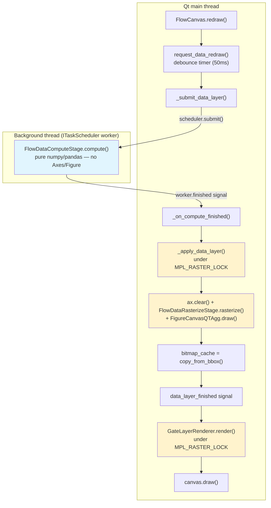
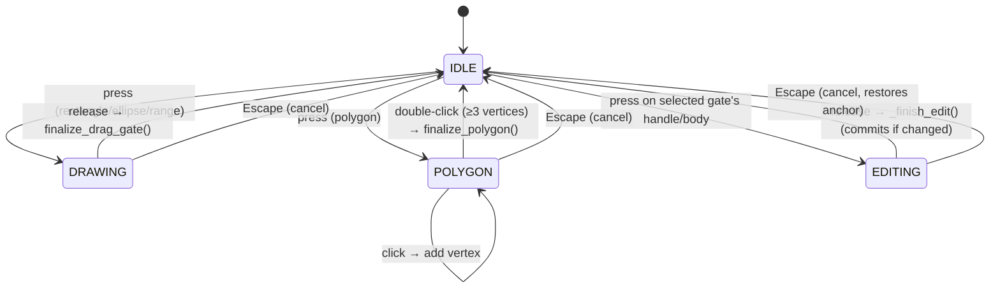

# Rendering & Visualization Architecture

How `FlowCanvas` gets pixels on screen: the layered async/sync canvas model, the
compute/rasterize split that keeps the Qt main thread unblocked, the shared
matplotlib lock, interactive gate drawing, and the node-graph canvas's
dirty-region repainting.

!!! note "This document reflects a recent architecture migration"
    Five commits reworked this subsystem in sequence: `3b160bf` (shared
    `MPL_RASTER_LOCK`), `4c11ead` (`DisplayStrategy.compute()`/`draw()` split),
    `28d6e04` (`FlowCanvas` onto `LayeredMatplotlibCanvas`), `a1464cf`
    (de-duplicated lock retry logic in `gate_drawing_fsm.py`), `cd6e5ed`
    (`node_canvas` dirty-region tracking). Anything you remember about a
    synchronous `DataLayerRenderer` class, a private `_mpl_lock.py`, or a fused
    `DisplayStrategy.render()` method is describing code that no longer exists.

---

## 1. The big picture

`FlowCanvas` (`ui/graph/flow_canvas.py`) renders a plot in **two layers** that
redraw independently:

- **Data layer** — the expensive part: transform the raw event arrays,
  compute a density grid / KDE / histogram, scatter or hist it onto the
  `Axes`. This runs its numeric half *off* the Qt main thread and only
  touches matplotlib for a brief, lock-guarded rasterize step.
- **Gate overlay layer** — cheap: draw patches/lines/labels for whatever
  gates are active, on top of a cached bitmap of the data layer. This never
  leaves the Qt main thread and never recomputes the data layer.

A third, even cheaper layer exists only while a gate is actively being
drawn or dragged: **the FSM preview layer** (rubber-band, polygon-in-progress,
quadrant crosshair, live edit-drag), drawn by `GateDrawingFSM` via
`copy_from_bbox`/`restore_region` blitting against the canvas's own bitmap
cache — not through the SDK's overlay-blit primitive (see
[§6](#6-why-the-fsm-does-not-use-draw_overlay_artists_blit)).



Everything shaded yellow above runs under `MPL_RASTER_LOCK` — matplotlib's
Agg backend is not thread-safe, so every rasterization call across the whole
process (this canvas, the gate overlay, thumbnails, `RenderTask`, any other
plugin's matplotlib widget) must serialize through one shared lock instance.

---

## 2. `LayeredMatplotlibCanvas` — the SDK base class

`FlowCanvas` subclasses `karcytics_sdk.plugin.rendering.mpl_canvas.LayeredMatplotlibCanvas`
(a `FigureCanvasQTAgg` subclass), added in `28d6e04`. Before that migration,
`FlowCanvas` inherited `FigureCanvasQTAgg` directly and ran a synchronous
`DataLayerRenderer.render()` call on the Qt main thread for every redraw —
the expensive density/KDE computation blocked the UI. `DataLayerRenderer` is
now deleted entirely; its logic lives in `FlowDataComputeStage`/
`FlowDataRasterizeStage` (§4).

`LayeredMatplotlibCanvas` provides:

- **`set_compute_stage(stage)` / `set_rasterize_stage(stage)`** — register
  the plugin-specific `RenderComputeStage`/`RasterizeStage` pair once, at
  construction.
- **`request_data_redraw(state, debounce_ms=50)`** — the entry point. Starts
  (or restarts) a `QTimer`; rapid successive calls (e.g. an axis slider being
  dragged) collapse into a single compute submission once the debounce window
  elapses. Requires both stages to already be set, or it raises.
- **`_submit_data_layer()`** — fires when the debounce timer elapses.
  Submits `self._compute_stage` to `task_scheduler.submit()`
  (`ITaskScheduler`, defaulting to `runtime_services.task_scheduler`) and
  connects `worker.finished`/`worker.error` to generation-gated callbacks.
- **Generation gating** — every submission increments `self._generation`;
  a result is applied only if its captured generation still matches the
  current one. A slow compute superseded by a newer request is dropped
  instead of visually reverting an already-applied newer result.
- **`_apply_data_layer(render_data)`** — runs `ax.clear()` +
  `self._rasterize_stage.rasterize(ax, render_data)` + `FigureCanvasQTAgg.draw()`
  + `self._bitmap_cache = self.copy_from_bbox(...)`, all under
  `self.raster_lock.try_run(...)`.
- **`draw_overlay_artists_blit(artists)`** — the SDK's own cheap-overlay
  primitive: restores `self._bitmap_cache` and blits `artists` on top. Cheap,
  synchronous, never touches the task scheduler. `FlowCanvas` deliberately
  does **not** use this for its gate overlay or FSM previews — see
  [§6](#6-why-the-fsm-does-not-use-draw_overlay_artists_blit).
- **`paintEvent()` / `draw()` overrides** — both run under
  `self.raster_lock.try_run(...)`, retrying via `QTimer.singleShot` if the
  lock is contended by a background render. `FlowCanvas` re-overrides both
  again (see §3) purely to swap the retry callback for one that tolerates
  the widget having been destroyed mid-retry.
- **Signals**: `data_layer_started`, `data_layer_finished`, `data_layer_failed(str)`.

Constructor parameters worth knowing: `raster_lock` and `task_scheduler` are
both injectable, defaulting to the process-wide `MPL_RASTER_LOCK` singleton
and `runtime_services.task_scheduler` — this is what lets tests substitute a
synchronous fake scheduler and a private lock (see
[03_TESTING_AND_QA.md](03_TESTING_AND_QA.md)). `crash_reporter` and
`plugin_id` are also accepted and threaded through to
`FlowDataRasterizeStage`'s failure path, but `FlowCanvas` is constructed
today (from `GraphWindow`) without a `crash_reporter` — `GraphWindow`/
`GraphManager` don't yet hold a reference to pass down, so it defaults to
`None`. The plumbing exists for a future caller.

---

## 3. `FlowCanvas` itself

`ui/graph/flow_canvas.py`. Owns:

- The `Figure`/`Axes` (`self._fig`, `self._ax`), styled via a module-level
  `_MPL_STYLE` rcParams dict applied at construction (white plot background,
  dark-grey text/grid, 9pt fonts).
- Data state: `_current_data` (a `pd.DataFrame`), `_x_param`/`_y_param`,
  `_x_scale`/`_y_scale` (`AxisScale`), `_display_mode` (`DisplayMode` enum:
  `PSEUDOCOLOR`, `DOT_PLOT`, `CONTOUR`, `HISTOGRAM`, `CDF`).
- Gate drawing state: `_drawing_mode` (`GateDrawingMode` enum), delegated to
  `GateDrawingFSM` (§6).
- The data-layer bitmap cache (`_canvas_bitmap_cache`, refreshed by the
  `draw_event` handler `_on_draw` — every full Agg draw, not just data-layer
  draws — so it always has the current gate overlays baked in; see §6 for
  why that distinction matters).
- Decomposed helper components, constructed in `__init__` and each covering
  one previously-monolithic responsibility (see §7).

### `redraw()` — the public trigger

```python
def redraw(self) -> None:
    if getattr(self, "_batch_update", False):
        return
    if self.width() <= 0 or self.height() <= 0:
        QTimer.singleShot(200, self.redraw)  # 0x0 during layout — retry
        return
    self._dirty = False
    self._canvas_bitmap_cache = None
    self._show_loading()
    self.request_data_redraw(self._snapshot_render_state(), debounce_ms=50)
```

Every setter that changes what's on screen (`set_data`, `set_axes`,
`set_scales`, `set_display_mode`, `set_fmo_overlay`) ends by calling
`redraw()`. `begin_update()`/`end_update()` let a caller batch several
setters into one redraw. `_snapshot_render_state()` captures a
`FlowRenderState` (§4) on the Qt main thread — the object handed across the
thread boundary to `FlowDataComputeStage.compute()`.

### `paintEvent()`/`draw()` re-overrides

`FlowCanvas` re-overrides both methods that `LayeredMatplotlibCanvas` already
overrides, purely to change the retry callback:

```python
def paintEvent(self, event) -> None:
    self.raster_lock.try_run(lambda: FigureCanvasQTAgg.paintEvent(self, event), self._retry_update)


def _retry_update(self) -> None:
    if sip.isdeleted(self):
        return
    self.update()
```

`LayeredMatplotlibCanvas.paintEvent()`'s own retry is just `self.update` —
fine for the base class, but a `FlowCanvas` can be `deleteLater()`'d (tab
closed) while a `QTimer.singleShot` retry is still queued. Touching a
destroyed Qt C++ object from that queued callback crashes **natively**
(not a catchable `RuntimeError`, because it isn't a normal Python call PyQt
can intercept) — hence the `sip.isdeleted()` guard before every retry.

### `_on_data_layer_finished()` — where the two layers meet

```python
def _on_data_layer_finished(self) -> None:
    self._hide_loading()
    self._gate_renderer.render()
    step = getattr(self, "_current_tutorial_step", None)
    if step is not None:
        self.set_tutorial_guide(step)
    self.draw()
```

Connected to `LayeredMatplotlibCanvas.data_layer_finished`. This is the only
place the data layer and gate layer are sequenced together: once the async
compute+rasterize has landed (and `ax.clear()` has wiped every artist),
gate overlays and tutorial guides are re-drawn on top, then a forced
(non-idle) `draw()` flushes it all to screen.

---

## 4. Data-layer compute/rasterize split

The SDK's `karcytics_sdk.plugin.rendering.pipeline` module defines the
general contract; `ui/graph/canvas/data_layer.py` implements it for flow
plots.

### SDK contract (`pipeline.py`)

```python
class RenderData:
    """Backend-agnostic bag of arrays/params. Must never hold a live
    Artist/Axes/Figure — only safe to touch under a RasterLock."""


class RenderComputeStage(AnalysisBase):
    @abstractmethod
    def compute(self, state: PluginState | None) -> RenderData: ...
    def run(self, state=None) -> dict[str, Any]:
        return {"render_data": self.compute(state)}  # AnalysisBase.run() bridge


class RasterizeStage(ABC):
    @abstractmethod
    def rasterize(self, target: Any, data: RenderData) -> None: ...
```

`RenderComputeStage` subclasses `AnalysisBase` and implements `run()` once,
generically — that's what lets it drop straight into the existing
`AnalysisWorker`/`AnalysisRunnable`/`ITaskScheduler.submit()` machinery with
no new dispatch path. `RasterizeStage` does **not** acquire a lock itself;
the caller (`LayeredMatplotlibCanvas._apply_data_layer`, or
`RasterizeToImageTask` for a fully-background render) is responsible for
holding the matching `RasterLock` around the call.

### Plugin implementation (`ui/graph/canvas/data_layer.py`)

```python
@dataclass
class FlowRenderState:
    """Snapshot of what compute() needs, captured on the Qt main thread
    right before request_data_redraw()."""
    current_data: pd.DataFrame | None
    x_param: str; y_param: str
    x_scale: AxisScale; y_scale: AxisScale
    display_mode: DisplayMode
    ...

@dataclass
class FlowRenderData(RenderData):
    """What compute() hands rasterize(): everything needed to draw."""
    mode: str = "empty"   # "empty" | "error" | "1d" | "2d"
    strategy: DisplayStrategy | None = None
    strategy_data: Any = None
    strategy_kwargs: dict = field(default_factory=dict)
    xlim: tuple[float, float] | None = None
    ylim: tuple[float, float] | None = None
    ...

class FlowDataComputeStage(RenderComputeStage):
    def compute(self, state: Any | None) -> FlowRenderData:
        # apply_transform() on raw arrays, calculate_auto_range() for
        # xlim/ylim, look up a DisplayStrategy via RenderStrategyFactory,
        # call strategy.compute(...). No Axes/Figure ever touched.

class FlowDataRasterizeStage(RasterizeStage):
    def __init__(self, canvas: FlowCanvas) -> None:
        self.canvas = canvas   # needed to reset gate/guide tracking state

    def rasterize(self, target: Any, data: Any) -> None:
        # ax.set_axis_on(), reset canvas._gate_patches/_gate_artists/
        # _gate_overlay_artists/_guide_poly_patch (ax.clear() already ran,
        # invalidating whatever those referenced), then dispatch on
        # data.mode: "empty"/"error" show a message; "1d"/"2d" call
        # data.strategy.draw(ax, data.strategy_data, **data.strategy_kwargs)
        # plus axis labels, spines, grid, event-count annotation.
```

`FlowRenderState` deliberately holds **references**, not deep copies, of
`x_scale`/`y_scale`/`flow_state` — the same tradeoff `RenderTask` already
makes for its own thumbnail path. A scale object mutated in place (rather
than replaced wholesale, which is how `FlowCanvas.set_scales()` normally
does it) after the snapshot was taken could race an in-flight `compute()`.
This is narrow, pre-existing exposure, not something the split introduced.

`FlowDataRasterizeStage` needing a live `canvas` reference is the one place
this stage isn't purely functional — it has to reset gate-tracking
dictionaries that the caller's `ax.clear()` just invalidated, mirroring what
the old `DataLayerRenderer.render()` did at the top of its own lock-held
block.

!!! warning "1D fallback path"
    For `HISTOGRAM`/`CDF` modes, `compute()` tries `_compute_1d()` first; if
    that strategy's `compute()` raises, it falls through to `_compute_2d()`
    instead — matching the old `DataLayerRenderer._render_1d()`'s
    "return `False`" fallback behavior. A failing 1D strategy silently
    produces a 2D plot rather than an error.

---

## 5. `DisplayStrategy` — compute()/draw() split

`ui/graph/renderers/base.py`, changed by `4c11ead`. Before that commit, each
strategy had one fused `render(ax, x, y, **kwargs)` method that both computed
data (numpy/scipy) and drew it (matplotlib `Axes` calls) in one shot — so
even the compute-only parts of a strategy had to run wherever `render()` was
called, which was always somewhere holding a lock. The split:

```python
class DisplayStrategy(ABC):
    @abstractmethod
    def compute(self, x, y=None, *, xlim=None, ylim=None, **kwargs) -> Any:
        """Pure numpy/scipy. Safe to run off the Qt main thread.
        Must never touch a matplotlib Axes/Figure."""

    @abstractmethod
    def draw(self, ax: Axes, data: Any, **kwargs) -> None:
        """Draw data (compute()'s return value) onto ax.
        Must run under MPL_RASTER_LOCK."""
```

`render()` was deleted outright — not kept as a compatibility shim. Both
callers (`FlowDataComputeStage`/`FlowDataRasterizeStage`, and `RenderTask`,
§9) call `compute()` then `draw()` directly.

Concrete strategies, registered in `ui/graph/renderers/factory.py`'s
`RenderStrategyFactory`:

| Mode name | Class | File |
|---|---|---|
| `"Pseudocolor"` | `PseudocolorStrategy` | `renderers/pseudocolor.py` |
| `"Dot Plot"` | `DotPlotStrategy` | `renderers/dotplot.py` |
| `"Histogram"` | `HistogramStrategy` | `renderers/histogram.py` |
| `"Contour"` | `ContourStrategy` | `renderers/contour.py` |
| `"CDF"` | `CdfStrategy` | `renderers/cdf.py` |

`RenderStrategyFactory.get_strategy(name)` falls back to `"Dot Plot"` for an
unrecognized name. Each concrete strategy pairs a small `@dataclass` result
type with its `compute()`/`draw()` pair — e.g. `PseudocolorStrategy`:

```python
@dataclass
class PseudocolorRenderData:
    x_plot: np.ndarray
    y_plot: np.ndarray
    c_plot: np.ndarray
    cmap_name: str
    alpha: float
    point_size: float


class PseudocolorStrategy(DisplayStrategy):
    def compute(self, x, y=None, *, xlim=None, ylim=None, **kwargs) -> PseudocolorRenderData | None:
        # stable_subsample_mask() down to max_events, then
        # compute_pseudocolor_points() — the density-binning + Gaussian
        # smoothing + rank-normalized color mapping math.
        ...

    def draw(self, ax, data, **kwargs) -> None:
        ax.scatter(
            data.x_plot,
            data.y_plot,
            s=data.point_size,
            c=data.c_plot,
            cmap=data.cmap_name,
            vmin=0.0,
            vmax=1.0,
            alpha=data.alpha,
            marker="o",
            rasterized=True,
            edgecolors="none",
            zorder=0,
        )
```

`HistogramRenderData` is a good example of the split's actual payoff: it
precomputes the valid-data filtering and the scipy KDE curve (an O(n·grid)
evaluation) in `compute()`, but leaves the `ax.hist()` call itself in
`draw()` — reimplementing matplotlib's own binning/patch logic outside
matplotlib isn't worth the behavioral risk, and `ax.hist()` is cheap next to
the KDE evaluation anyway.

For `RenderTask` (§9), this split additionally moved the `compute()` call
*above* the lock acquisition — thumbnail density/KDE computation is no
longer serialized against other concurrent thumbnail renders; only the
actual Agg `draw()` call still needs `MPL_RASTER_LOCK`.

---

## 6. Gate overlay layer

`ui/graph/canvas/gate_layer.py`'s `GateLayerRenderer` draws gate
patches/labels on top of the cached data-layer bitmap, without ever
recomputing the data layer:

```python
class GateLayerRenderer:
    def render(self) -> None:
        if not MPL_RASTER_LOCK.acquire(blocking=False):
            QTimer.singleShot(50, self.render)
            return
        try:
            # remove previous gate artists, clear tracking dicts
            self._redraw_gate_overlays()  # walk canvas._active_gates,
            # dispatch to GateOverlayRenderer
            canvas.draw_idle()
        finally:
            MPL_RASTER_LOCK.release()
```

!!! note "Not migrated to `raster_lock.try_run()`"
    `a1464cf` de-duplicated this exact acquire/retry/release pattern inside
    `gate_drawing_fsm.py` (§7), but `GateLayerRenderer.render()` still
    hand-rolls it, and imports the module-level `MPL_RASTER_LOCK` singleton
    directly rather than going through `canvas.raster_lock`. In normal
    operation these are the same object, so it behaves identically — but a
    test that injects a private `raster_lock` into `FlowCanvas`'s
    constructor (see `LayeredMatplotlibCanvas.__init__`) will find
    `GateLayerRenderer` still contending on the real process-wide lock
    instead of the injected one. If you're extending this file, prefer
    `canvas.raster_lock.try_run(...)` for consistency with the rest of the
    canvas and to respect lock injection.

`_redraw_gate_overlays()` handles a few subtleties worth knowing before you
touch it:

- **1D-mode filtering**: on `HISTOGRAM`/`CDF` axes, only `RangeGate`s are
  drawn (a rectangle/polygon/ellipse gate has no meaning on a 1D axis).
- **Quadrant de-duplication**: a `QuadrantGate` has 4 `QuadrantSubGate`
  children sharing one crosshair; `_redraw_gate_overlays` tracks
  `recorded_geometries` by parent id so the crosshair is drawn once, not 4
  times.
- **Selection resolution**: `canvas._selected_gate_id` holds a
  `GateNode.node_id`, *not* a `Gate.gate_id` — they're independently
  generated UUIDs with no relationship — so selection is resolved by walking
  `canvas._gate_nodes` for a node wrapping this gate's geometry, not by
  direct id comparison.
- **Range gate y-matching**: `RangeGate.y_param` is always `None` (it's a
  1D gate), which is treated as "matches any Y axis" rather than filtered
  out — same convention `RenderTask` uses for subplot thumbnails.

### Why the FSM does not use `draw_overlay_artists_blit()`

`LayeredMatplotlibCanvas.draw_overlay_artists_blit()` restores from
`self._bitmap_cache`, which is refreshed only after a **data-layer** redraw.
`FlowCanvas`'s own `_canvas_bitmap_cache` (a separate attribute, refreshed on
every `draw_event` — including `GateLayerRenderer`'s own render, via
`_on_draw`) has the *persistent gate overlays baked in*. `a1464cf`'s commit
message is explicit about why these can't be unified:

> Switching would make every *other* gate disappear while dragging one
> gate's handle. FlowCanvas's real layering (data + persistent gate overlays
> + ephemeral drag preview) doesn't fit the SDK's simpler two-layer model.

So `FlowCanvas` keeps its own three-layer bitmap-cache scheme
(`_canvas_bitmap_cache`/`_on_draw`) rather than adopting the SDK's two-layer
one, even though both now share the same lock primitive.

---

## 7. Interactive gate drawing — `GateDrawingFSM`

`ui/graph/gate_drawing_fsm.py`. States (`DrawingState` enum):



`IDLE` press dispatches through a fallthrough: hit-test the selected gate's
**edit handle** first, then its **body** (whole-gate move), then fall back to
**select** (or Alt+click **cycle-select**, to reach a gate fully occluded by
another). Only the *currently selected* gate ever exposes handles/body-move —
a drag can never accidentally grab whichever gate happens to be underneath.

### The lock dedup (`a1464cf`)

Six methods — `_draw_rubber_band`, `_apply_edit_preview`,
`_draw_quadrant_crosshair`, `_draw_polygon_progress`, and their two "clear"
counterparts — each used to hand-roll the identical
`MPL_RASTER_LOCK.acquire(blocking=False)` / `try` / `finally: release()`
dance, with a per-method debounced `QTimer` retry on contention. `a1464cf`
collapsed all six onto the shared primitive that pattern was originally
generalized from:

```python
def _draw_rubber_band(self, x0, y0, x1, y1, mode):
    def _on_busy() -> None:
        self._pending_rubber_args = (x0, y0, x1, y1, mode)
        if not getattr(self, "_rubber_timer_active", False):
            self._rubber_timer_active = True

            def _retry() -> None:
                self._rubber_timer_active = False
                if hasattr(self, "_pending_rubber_args"):
                    self._draw_rubber_band(*self._pending_rubber_args)

            QTimer.singleShot(15, _retry)

    def _action() -> None: ...  # the actual patch creation + restore_region/draw_artist/blit

    self.canvas.raster_lock.try_run(_action, _on_busy)
```

Each method's **own** debounced-retry bookkeeping (`_pending_*_args`,
`_*_timer_active` flags, retry delays of 10-15ms tuned per gesture) is kept
exactly as it was — only the acquire/try/finally *mechanics* moved into
`canvas.raster_lock.try_run(action, on_busy)`. This matters because the
retry delay and "coalesce to latest pending args" behavior is itself part of
the interaction design (e.g. a fast mouse-motion stream during a drag
shouldn't queue up N retries — it should keep overwriting `_pending_*_args`
until the lock frees up), and `try_run()` itself is generic and knows
nothing about per-gesture debouncing.

### `_apply_edit_preview()` — the live-drag fast path

Motion events during an `EDITING` drag call `_apply_edit_preview(x, y)`,
which **mutates the real `Gate` object in place** and redraws only its
overlay via `restore_region`/`draw_artist`/`blit` — it never calls
`controller.modify_gate()`. That's the entire performance strategy: the
expensive path (recompute stats, `GATE_MODIFIED` event, debounced
propagation to other views) fires exactly once, in `_finish_edit()`, not on
every motion event. If the drag is cancelled (`Escape`), `GateDrawingFSM.cancel()`
calls `canvas._gate_editor.restore(gate, anchor)` to undo the in-place
mutation, since nothing else would.

---

## 8. `MPL_RASTER_LOCK` and `RasterLock`

`karcytics_sdk.plugin.rendering.lock.RasterLock` — promoted in `3b160bf`
from what used to be this plugin's own private `ui/graph/_mpl_lock.py`
(now **deleted**, no compatibility shim kept). Every one of the 13 call
sites that used to import the private lock now imports
`from karcytics_sdk.plugin.rendering.lock import MPL_RASTER_LOCK` directly.

```python
class RasterLock:
    """Reentrant, named lock guarding one rasterization backend's shared state."""

    def __init__(self, name: str = "default") -> None:
        self._lock = threading.RLock()  # reentrant — see below

    def try_run(
        self, action, on_busy_retry, retry_ms=50, crash_reporter=None, plugin_id=None
    ) -> None:
        """Non-blocking acquire. On success: run `action` (exceptions caught
        and logged, optionally reported to crash_reporter). On contention:
        schedule `on_busy_retry` via QTimer.singleShot(retry_ms, ...) and
        return without running `action` — the retry callback must call back
        into try_run() itself."""


MPL_RASTER_LOCK = RasterLock(name="matplotlib-agg")  # process-wide singleton
```

Why it matters that this is **shared**, not per-plugin:

- matplotlib's Agg backend keeps C-level shared state (glyph cache, font
  transforms); concurrent draws from different `Figure`s on different
  threads can corrupt it — on ARM macOS specifically, this has manifested as
  a `SIGBUS`, not just a wrong pixel.
- Any *other* plugin's matplotlib widget, or a shared "export image" action,
  contends for the exact same backend state — so it must serialize through
  the exact same lock **instance**, not merely "a `RasterLock` of the same
  type." Hence a plain importable singleton (matching the SDK's convention
  for `runtime_services.task_scheduler`/`event_bus`), not something gated
  behind a plugin manifest capability.
- It's an `RLock`, deliberately: a Qt canvas's `paintEvent()` can internally
  re-invoke `draw()` on the same thread that already holds the lock
  (matplotlib's Qt backend does this via `_draw_idle()`). A plain `Lock`
  would treat that inner acquire as contended and defer it via retry,
  silently dropping the real paint.
- **Scope**: one `MPL_RASTER_LOCK` instance per OS process's Agg state. This
  plugin runs `process_model = "isolated"` (see `pyproject.toml`), so it
  already gets its own interpreter and its own independent lock instance —
  no cross-process coordination needed. `PluginDaemon` file-I/O subprocesses
  do no matplotlib rasterization and never contend for it at all.

### `LockedFigureCanvas` (`ui/graph/_mpl_compat.py`)

For any *other* standalone plot widget in this plugin that isn't
`FlowCanvas` — a drop-in `FigureCanvasQTAgg` replacement:

```python
class LockedFigureCanvas(FigureCanvasQTAgg):
    def draw(self) -> None:
        MPL_RASTER_LOCK.try_run(super().draw, self._retry_draw)

    def paintEvent(self, event) -> None:
        MPL_RASTER_LOCK.try_run(
            lambda: super(LockedFigureCanvas, self).paintEvent(event), self._retry_update
        )
```

`3b160bf` rewrote this class too, onto `RasterLock.try_run()` instead of its
own hand-rolled acquire/retry/release — `_mpl_compat.py`'s docstring notes
this is literally the pattern `try_run()` was generalized *from*.

### Other lock-guarded call sites

- `FlowCanvas._copy_to_clipboard()` / `_on_download_plot()` — `savefig()`
  triggers a full Agg rasterization pass and must hold the lock the same as
  `paintEvent()`/`draw()`, via a plain `with MPL_RASTER_LOCK:` block (these
  are one-shot synchronous user actions, not retry-on-contention paths, so
  blocking acquire is fine here).
- `RenderTask.run()` (§9) — holds the lock around figure creation, `draw()`,
  and buffer extraction, but *not* around `compute()`.
- `GateLayerRenderer.render()` (§6) — see the note above about not using
  `try_run()`.

---

## 9. `RenderTask` — background subplot/thumbnail rendering

`ui/graph/render_task.py`. An `AnalysisBase` (not a bare `QRunnable`) that
renders a plot to an in-memory RGBA buffer for thumbnails, node-graph
previews, and group comparisons — using the exact same `DisplayStrategy`
instances as the main canvas, for pixel parity.

```python
def run(self, state=None) -> dict:
    ...
    # compute() runs OUTSIDE the lock — expensive density/KDE work isn't
    # serialized against other concurrent renders.
    render_data = strategy.compute(x_vis, y_vis, xlim=xlim, ylim=ylim, **kwargs)

    with _MPL_LOCK:
        fig = Figure(...)
        canvas = FigureCanvasAgg(fig)
        ax = fig.add_axes([0, 0, 1, 1])
        ...
        strategy.draw(ax, render_data, **kwargs)  # only this needs the lock
        if c.get("gates"):
            # GateOverlayRenderer, same code path as the main canvas,
            # thinner lines (linewidth=0.6 vs 2.5) for subplot scale
            ...
        canvas.draw()
        image_data = bytes(canvas.buffer_rgba())
    return {"image_data": image_data, "width": ..., "height": ...}
```

`4c11ead` moved the `compute()` call above the `with _MPL_LOCK:` block — a
direct consequence of the `DisplayStrategy` split (§5): before that commit,
`RenderTask` called the old fused `render()`, so the whole thing —
computation included — ran inside the lock, serializing thumbnail density
computation across every concurrent thumbnail render.

---

## 10. Decomposed `FlowCanvas` collaborators

`FlowCanvas.__init__` wires up several single-responsibility helper classes
rather than implementing everything itself:

| Component | File | Responsibility |
|---|---|---|
| `CanvasEventHandler` | `ui/graph/canvas/event_handler.py` | mpl mouse/keyboard event → `GateDrawingFSM` dispatch; gate hit-testing (`try_select_gate`, `artist_contains_point`); finalization callbacks the FSM calls back into (`finalize_drag_gate`, `finalize_polygon`, `finalize_quadrant`) |
| `AxisFormatter` | `ui/graph/canvas/axis_formatter.py` | Biological-decade tick formatting (`$10^3$`, `$10^4$`, ...) for non-linear axes; shades the biexponential linear region |
| `OverlayManager` | `ui/graph/canvas/overlay_manager.py` | Loading/empty/error states and the on-canvas drawing-instruction text (`"Click and drag to draw a rectangle"`, etc.) |
| `ZoomHandler` | `ui/graph/canvas/zoom_handler.py` | Scroll-wheel zoom — computes new axis bounds in *visual* (transformed) space, then converts back to raw data space via `inverse_transform_x/y` before writing to the parent's `AxisScale` |
| `GateLayerRenderer` | `ui/graph/canvas/gate_layer.py` | See §6 |
| `GateDrawingFSM` | `ui/graph/gate_drawing_fsm.py` | See §7 |

`CanvasEventHandler.try_select_gate()` is also where overlap and occlusion
are resolved: `_gate_overlay_artists` is populated in the draw order
`GateLayerRenderer` used, so later entries render on top, and a normal click
picks `hits[-1]` (top-most); Alt+click instead cycles to the *next* hit past
the currently-selected one, wrapping around.

`CanvasEventHandler.artist_contains_point(artist, px, py)` is a small but
important hit-testing shim: `Patch` subclasses (`Rectangle`, `Ellipse`,
`Polygon`) implement `contains_point((px, py))` directly, but `Line2D` —
used as the overlay `patch` for `RangeGate`/`QuadrantGate`, whose visuals
are lines rather than filled shapes — only has the generic
`Artist.contains(mouseevent)`, which wants an object exposing pixel `.x`/`.y`
attributes rather than a raw coordinate pair. `_PixelEvent` is that minimal
shim.

---

## 11. `GraphManager`, `flow_services`, coordinate mapping

- **`GraphManager`** (`ui/graph/graph_manager.py`) — a `QTabWidget`-backed
  container of `GraphWindow`s, one per open sample/gate combination
  (`"{sample_id}:{node_id or 'root'}"` keyed). Forwards tool selection
  (`set_drawing_mode`) and gate events to/from whichever `GraphWindow` is
  active, and propagates `AxisScale` changes to other graphs viewing samples
  in the same comparison group (`_on_axis_scale_sync`).
- **`CoordinateMapper`** (`ui/graph/flow_services.py`) — wraps
  `apply_transform`/`invert_transform` (see
  [06_TRANSFORMS_AND_SCALING.md](06_TRANSFORMS_AND_SCALING.md)) with the
  current `x_scale`/`y_scale`, exposing `transform_x/y`,
  `inverse_transform_x/y`, `transform_point`/`untransform_point`. Always
  passes `enable_dithering=False` for biexponential transforms — dithering
  is meant for the raw per-event arrays of a density plot (jitters by ±0.5
  to avoid integer "barcode" banding); a `CoordinateMapper` computes *exact*
  positions (axis limits, gate boundaries, click coordinates) where the same
  input must always map to the same output.
- **`GateFactory`** — builds `Gate` subclass instances (`RectangleGate`,
  `PolygonGate`, `EllipseGate`, `QuadrantGate`, `RangeGate`) from
  display-space drawing coordinates, inverse-transforming through the
  `CoordinateMapper` to store geometry in raw data space.
- **`GateOverlayRenderer`** — renders `Gate` → `OverlayArtists` (a
  `patch`/`label_text`/`handles` bundle) via `render_gate()`'s dispatch
  (`GateRegistry` lookup first, then a `render_<type>` method by name).
  `resolve_gate_color()` derives a gate's color deterministically from a
  CRC32 of its own id — stable across the main plot, group-preview
  thumbnails, and node-graph thumbnails, regardless of which panel or list
  position is rendering it.

---

## 12. `node_canvas` — dirty-region tracking (`cd6e5ed`)

The node-graph view (`ui/widgets/node_canvas/`) is a separate `QGraphicsView`/
`QGraphicsScene` world from `FlowCanvas` — it shows the gate hierarchy as
draggable `NodeItem`/`EdgeItem` boxes, not matplotlib plots. `cd6e5ed`
migrated it onto the SDK's `karcytics_sdk.plugin.rendering.graphics_scene`
base classes:

```python
class DirtyTrackingGraphicsScene(QGraphicsScene):
    def mark_dirty(self, item: QGraphicsItem) -> None:
        """Drop-in replacement for item.update(). Under
        KARCYTICS_STRICT_DIRTY_TRACKING, also warns if boundingRect()
        changed since the last mark_dirty() call for this item — an
        imperfect but useful signal for a missing prepareGeometryChange()."""
        ...
        item.update()


class DirtyTrackingGraphicsView(QGraphicsView):
    def __init__(self, scene, parent=None, update_mode=None) -> None:
        super().__init__(scene, parent)
        self.setViewportUpdateMode(
            update_mode or QGraphicsView.ViewportUpdateMode.MinimalViewportUpdate
        )
```

Before this commit, `_CanvasGraphicsView` (`ui/widgets/node_canvas/canvas_view.py`)
explicitly forced `FullViewportUpdate` — every single node/edge change
repainted the *entire* viewport, regardless of how small the actual change
was. After: `_CanvasGraphicsView` subclasses `DirtyTrackingGraphicsView`
(`MinimalViewportUpdate` by default), `NodeCanvas`'s scene is a
`DirtyTrackingGraphicsScene`, and `CanvasManager.update_nodes()`/
`update_edges()` call `self.scene.mark_dirty(item)` instead of a bare
`item.update()`.

### The `prepareGeometryChange()` bug this exposed

`NodeItem.set_orientation()` (`ui/widgets/node_canvas/items/node_item.py`)
mutates `self._orientation`, which `boundingRect()` depends on:

```python
def set_orientation(self, orientation: str) -> None:
    # boundingRect() depends on _orientation — must call this before
    # mutating it, or MinimalViewportUpdate can leave stale/clipped pixels
    # where the item's bounds just changed.
    self.prepareGeometryChange()
    self._orientation = orientation
    self._mark_dirty()
```

Before `cd6e5ed`, this method mutated `_orientation` and called `update()`
with **no** `prepareGeometryChange()` call. Under the old
`FullViewportUpdate` mode this bug was invisible — every paint already
covered the whole viewport regardless of what changed. Under
`MinimalViewportUpdate`, Qt uses each item's `boundingRect()` to compute
which screen region needs repainting; a geometry change that skips
`prepareGeometryChange()` means Qt's cached bounding-rect bookkeeping is
stale for exactly one frame, which can leave stale or clipped pixels on
screen after an orientation toggle. The commit verified the fix with a real
before/after `boundingRect()` check.

!!! warning "Gotcha for anyone extending `NodeItem`"
    Any method that mutates state `boundingRect()` reads from **must** call
    `self.prepareGeometryChange()` *before* mutating that state — not just
    call `update()`/`_mark_dirty()` after. This is a general `QGraphicsItem`
    contract (Qt needs the *old* bounds to invalidate correctly before you
    change to the *new* ones), but it was silently unenforced here as long
    as `FullViewportUpdate` was active. It no longer is. `EdgeItem` needed no
    equivalent fix — it goes through `QGraphicsPathItem.setPath()`, which
    already calls `prepareGeometryChange()` internally.

`NodeItem._mark_dirty()` is the routing shim:

```python
def _mark_dirty(self) -> None:
    scene = self.scene()
    if scene is not None and hasattr(scene, "mark_dirty"):
        scene.mark_dirty(self)
    else:
        self.update()  # unattached (e.g. a bare NodeItem constructed in a test)
```

The fallback exists because `scene()` is `None` until the item is actually
added to a scene — tests that construct a standalone `NodeItem` without
adding it anywhere still need `update()` to be a safe no-op-ish call.

To turn on the boundingRect-drift warning locally:

```bash
KARCYTICS_STRICT_DIRTY_TRACKING=1 pytest tests/ui/ -k node_canvas
```

---

## 13. Extension checklist

Adding a new plot type:

1. Add a `DisplayStrategy` subclass in `ui/graph/renderers/` with `compute()`
   (pure numpy/scipy) and `draw()` (matplotlib calls) methods.
2. Register it in `RenderStrategyFactory` (`renderers/factory.py`).
3. Add a `DisplayMode` enum member in `flow_canvas.py` if it's a new mode
   the UI should expose, and wire any mode-specific `render_config` kwargs
   in `FlowDataComputeStage._compute_1d`/`_compute_2d`
   (`ui/graph/canvas/data_layer.py`).
4. If it needs `RenderTask` thumbnail support, confirm the `plot_type` string
   mapping in `RenderTask.run()` resolves to your new factory key.

Adding a new gate type: extend `GateFactory` (creation from display
coordinates), `GateOverlayRenderer` (a `render_<type>` method, or a
`GateRegistry` overlay-renderer registration), and `GateDrawingFSM` if it
needs a new interactive drawing gesture beyond drag/click-polygon/click-point.

Adding a new standalone matplotlib widget elsewhere in this plugin: subclass
`LockedFigureCanvas` (`ui/graph/_mpl_compat.py`), not `FigureCanvasQTAgg`
directly, so its rasterization serializes through `MPL_RASTER_LOCK` like
everything else in the process.
