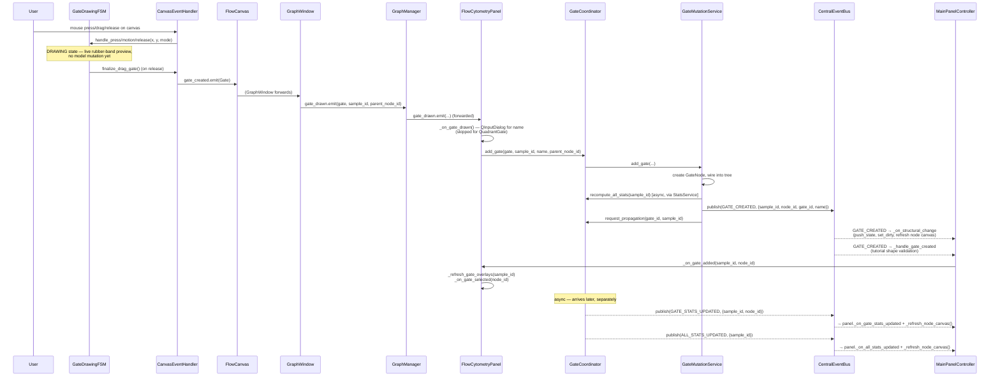

# Data Flow & Signal Connections

This document maps the module's actual event/signal wiring: which bus a
given topic travels on, where topics are defined, who publishes them, who
subscribes, and — for the operations that matter most — the full path from
a user action to every UI component that reacts to it. Every topic string,
class name, and method name below was confirmed by reading the source
listed next to it.

---

## 1. Two Separate Event/Signal Systems

The module uses three distinct communication mechanisms, and mixing them up
is an easy way to wire something that silently never fires:

| Mechanism | Scope | Defined in | Typical use |
|---|---|---|---|
| `CentralEventBus` | In-process, plugin-local pub/sub. Topics are the plain strings in `analysis/events.py` (prefixed `flow.`). | `karcytics_sdk.plugin.CentralEventBus` | Gate lifecycle, sample lifecycle, stats, compensation — anything the plugin's own domain layer needs to broadcast to decoupled UI listeners. |
| SDK `event_bus` / `KarcyticsEvent` | Cross-plugin / Hub-wide. In an isolated plugin process this is `runtime_services.event_bus`, a `RemoteEventBus`; `KarcyticsEvent` is a stand-in accessor (`_EventTopicAccessor`) whose attribute access (e.g. `KarcyticsEvent.ACADEMY_COURSE_COMPLETED`) resolves to the matching string topic. | `karcytics_sdk/plugin/runtime_services.py`, `karcytics_sdk/plugin/academy.py` | Academy/tutorial course lifecycle — the only user of this bus in this module (`main_panel.py`'s `_wire_signals`). |
| PyQt signals/slots | Direct widget-to-widget or widget-to-controller wiring, no bus. | Each widget's own `pyqtSignal` declarations. | Everything that's a 1:1 (or narrowly fan-out) relationship between two specific widgets — ribbon → graph manager, sample list → properties panel, etc. Wired centrally in `MainPanelController.wire()` (§3). |

`CentralEventBus.publish(topic, payload_dict)` is fire-and-forget and
**queued** — a callback that unsubscribes itself is not guaranteed to avoid
a delivery that was already queued before the unsubscribe ran. Several
`_cleanup_events`-style methods across the codebase (`FlowCanvas`,
`GraphManager`, `CanvasManager`) exist specifically to guard against this:
they check `sip.isdeleted(self)` (or an `_is_alive` flag) at the top of
every subscribed callback, because a gate event published just before a
canvas tab closes can still be delivered to it afterward.

---

## 2. `CentralEventBus` Topic Reference

All topics are plain string constants in `analysis/events.py`. This table
is exhaustive as of this rewrite — cross-check against the file if it
changes.

| Constant | String value | Published by | Notable subscribers |
|---|---|---|---|
| `GATE_CREATED` | `flow.gate.created` | `GateMutationService.add_gate()` via `GateEventPublisher.publish_gate_created()` | `MainPanelController` (undo/dirty + tutorial-shape validation), `FlowCanvas` (`_on_controller_geometry_changed`) |
| `LOGIC_NODE_CREATED` | `flow.gate.logic_node_created` | `GateMutationService.add_logic_node()` | `MainPanelController` (`_on_structural_change`) |
| `GATES_CREATED` | `flow.gate.batch_created` | `GateMutationService` for multi-node creations (e.g. quadrant gates → 4 nodes in one action) via `GateEventPublisher.publish_gates_created()` | `MainPanelController` (`_on_structural_change`, `_handle_gates_created`), `FlowCanvas` |
| `GATE_RENAMED` | `flow.gate.renamed` | `GateMutationService.rename_population()` via `GateEventPublisher.publish_gate_renamed()` | `MainPanelController`, `GraphManager._on_bus_event` (tab label refresh), `FlowCanvas` |
| `GATE_DELETED` | `flow.gate.deleted` | `GateMutationService.remove_population()` via `GateEventPublisher.publish_gate_deleted()` | `MainPanelController`, `FlowCanvas`, footer status |
| `GATE_MODIFIED` | `flow.gate.modified` | `GateMutationService.modify_gate()` via `GateEventPublisher.publish_gate_modified()` — fires **once per completed drag gesture**, never during live preview (§4 in `02_UI_ENGINE.md`) | `MainPanelController` (`_on_structural_change` — one edit = one undo step), `FlowCanvas` |
| `GATE_PROPAGATED` | `flow.gate.propagated` | *(defined; not observed published in the read source — likely legacy/reserved)* | — |
| `GATE_SELECTED` | `flow.gate.selected` | `GateSelectionService` (via `GateCoordinator.select_gate()`) using `GateEventPublisher.publish_gate_selected()` | `MainPanelController` (`_on_gate_selected_from_controller`), `FlowCanvas` (`_on_controller_selected`) |
| `GATE_PREVIEW` | `flow.gate.preview` | `GateDrawingFSM` during live drag/edit/polygon/quadrant preview, and `FlowCanvas._clear_previews()` | Subplot/thumbnail preview consumers |
| `SAMPLE_SELECTED` / `SAMPLE_DESELECTED` | `flow.sample.selected` / `flow.sample.deselected` | *(defined; selection is mostly handled via direct PyQt signals — see §3)* | — |
| `SAMPLE_LOADED` | `flow.sample.loaded` | Sample loading path | Footer status message (`main_panel._setup_footer_events`) |
| `RENDER_MODE_CHANGED` | `flow.render.mode_changed` | Display-mode changes | — |
| `RENDER_CONFIG_CHANGED` | `flow.render.config_changed` | Render settings changes | — |
| `AXIS_PARAMS_CHANGED` | `flow.axis.params_changed` | Axis parameter changes | — |
| `AXIS_RANGE_CHANGED` / `AXIS_RANGE_AUTO_UPDATED` | `flow.axis.range_changed` / `flow.axis.range_auto_updated` | Axis manager | — |
| `TRANSFORM_CHANGED` | `flow.transform.changed` | Transform dialog | — |
| `DISPLAY_MODE_CHANGED` | `flow.display.mode_changed` | Display mode toggle | — |
| `FMO_CHANGED` | `flow.fmo.changed` | FMO overlay selection | — |
| `STATS_COMPUTED` | `flow.stats.computed` | `GateCoordinator._on_stats_finished()` via `GateEventPublisher.publish_stats_computed()` | Footer status message |
| `STATS_INVALIDATED` | `flow.stats.invalidated` | *(defined; reserved)* | — |
| `COMPENSATION_APPLIED` | `flow.compensation.applied` | Compensation service | `MainPanelController` (`_on_state_mutated`), footer status |
| `UMAP_COMPLETED` | `flow.umap.completed` | `UmapService` | `MainPanelController` (`_on_state_mutated`), footer status |
| `AXIS_UPDATED` | `flow.axis.updated` | Internal axis-layer replacement topic | — |
| `GATE_STATS_UPDATED` | `flow.gate.stats_updated` | `GateCoordinator._on_stats_finished()` and `GateMutationService` (multiple sites) directly via `CentralEventBus.publish` (not through `GateEventPublisher`) | `MainPanelController` (`_on_stats_updated` — subscribed via the raw string `"flow.gate.stats_updated"`, not the constant) → `panel._on_gate_stats_updated` + `_refresh_node_canvas()` |
| `ALL_STATS_UPDATED` | `flow.gate.all_stats_updated` | `GateCoordinator._on_stats_finished()` | `MainPanelController` (`_on_all_stats`, subscribed via the raw string) → `panel._on_all_stats_updated` + `_refresh_node_canvas()`; `CanvasManager._on_stats_updated` |
| `PROPAGATION_REQUESTED` | `flow.gate.propagation_requested` | `GateCoordinator.request_propagation()` path | `GatePropagator` |
| `PROPAGATION_COMPLETE` | `flow.gate.propagation_complete` | `GatePropagator` after cross-sample cloning finishes | `MainPanelController` (`_on_prop_complete`) → `panel._on_propagation_complete` + flash message on partial failure |
| `SAMPLE_UPDATED` | `flow.gate.sample_updated` | `GatePropagator` per successfully-propagated sample | `MainPanelController` → `panel._on_propagated_sample_updated`, `_groups_panel.refresh()` |
| `EXPERIMENT_DATA_CHANGED` | `flow.experiment.data_changed` | Bulk experiment-level mutation (e.g. compensation across all samples) | — |

!!! note "Two topics are subscribed by raw string, not by constant"
    `MainPanelController.wire()` subscribes to `"flow.gate.stats_updated"`
    and `"flow.gate.all_stats_updated"` as literal strings rather than
    `events.GATE_STATS_UPDATED`/`events.ALL_STATS_UPDATED` — they happen to
    match exactly today, but a rename of either constant in `events.py`
    would silently desync this wiring without a type error. Same pattern in
    `CanvasManager`, which uses `flow_events.ALL_STATS_UPDATED` (the
    constant, correctly) but subscribes to `"flow.pipeline.connection_added"`/
    `"flow.pipeline.connection_removed"` as raw strings that don't have
    `events.py` constants at all.

### `GateEventPublisher`

`analysis/services/gate_event_publisher.py` centralizes *some* — not all —
`CentralEventBus.publish()` calls for gate events, specifically to
"decouple domain mutation from external system messaging" (its own module
docstring). It has no method for `GATE_STATS_UPDATED`/`ALL_STATS_UPDATED` —
those are published directly via `CentralEventBus.publish(events.GATE_STATS_UPDATED, ...)`
inline in `GateCoordinator._on_stats_finished()` and
`GateMutationService`, not routed through the publisher. If you're adding a
new gate-lifecycle event, prefer adding a method here for consistency with
`GATE_CREATED`/`GATE_DELETED`/`GATE_RENAMED`/`GATE_MODIFIED`/`GATE_SELECTED`/
`STATS_COMPUTED`; if you're touching stats events specifically, note the
existing precedent already bypasses it.

---

## 3. `MainPanelController.wire()` — the Central Wiring Point

`ui/controllers/main_panel_controller.py`'s `MainPanelController.wire(panel)`
(called once, from `FlowCytometryPanel._wire_signals()` at the end of Phase
2 — see `00_ARCHITECTURE_OVERVIEW.md` §3) is where almost every
cross-widget connection in the plugin is made, in one place, rather than
scattered across each widget's own `__init__`. It does two kinds of wiring:

1. **`CentralEventBus` subscriptions**, tracked in `panel._subscriptions`
   (a list of `(topic, callback)` tuples) so `unwire()` can cleanly
   unsubscribe everything on `panel.cleanup()`.
2. **Direct PyQt signal→slot connections** between specific widget pairs.

### Structural-change → undo/dirty tracking

```python
def _on_structural_change(payload):
    if not getattr(panel, "_loading", False):
        panel.push_state()
        panel.set_dirty(True)
    panel._refresh_node_canvas()
```

Subscribed to `GATE_CREATED`, `LOGIC_NODE_CREATED`, `GATES_CREATED`,
`GATE_DELETED`, `GATE_RENAMED`, and `GATE_MODIFIED`. This is the single
choke point that pushes an undo-history snapshot and marks the workspace
dirty for every structural gate edit — deliberately coarse-grained: one
`GATE_MODIFIED` per drag gesture (not per motion frame, see
`02_UI_ENGINE.md` §3) means one undo step per user-visible edit, "for
free", without `MainPanelController` needing gesture-level awareness itself.

A connection edit in the Pipeline tab that hasn't yet satisfied a logic
node's wiring requirements goes through a **separate**, similarly-named but
distinct handler:

```python
def _on_connection_pending(payload):  # MainPanelController's own copy
    if not getattr(panel, "_loading", False):
        panel.push_state()
        panel.set_dirty(True)
```

subscribed to the raw topics `"flow.pipeline.connection_added"` /
`"flow.pipeline.connection_removed"`. This still marks the workspace dirty
(a wiring change is undo-worthy) but does **not** call
`panel._refresh_node_canvas()` or trigger any full rebuild — that's
deliberate, because `CanvasManager` has its *own*, differently-scoped
subscriber to the exact same two topics
(`CanvasManager._on_connection_pending`, see `02_UI_ENGINE.md` §5) that does
a cheap, targeted redraw of just the affected node/edges. Two different
objects subscribed to the same topic doing two different, complementary
things — worth knowing before assuming a topic has exactly one handler.

### Tutorial-aware gate validation

`_handle_gate_created` / `_handle_gates_created` (subscribed to
`GATE_CREATED`/`GATES_CREATED`) additionally check whether an Academy
course's current step is a `GateShapeValidator`
(`tutorials/validators.py`). If the drawn gate's shape doesn't validate
against the tutorial's expected shape, the gate is **silently deleted**
(`panel._gate_coordinator.remove_population(...)`) and a transient red
flash banner ("Gate inaccurate. Please try again.") is shown via the
shared `_show_flash_message()` helper — the same helper used for partial
gate-propagation failures. Only after this check passes does
`panel._on_gate_added`/`_on_gates_added` run (refresh overlays + auto-select
the new node).

### Direct PyQt connections (selected)

| Signal | Slot |
|---|---|
| `panel._workspace_ribbon.samples_loaded` | `panel._on_samples_loaded` |
| `panel._pipeline_ribbon.sample_selected` | `panel._node_canvas.set_sample` |
| `panel._pipeline_ribbon.logic_node_requested` | `panel._gate_coordinator.add_logic_node` |
| `panel._node_canvas.node_double_clicked` | `panel._on_gate_double_clicked` |
| `panel._node_canvas.connection_requested` | `panel._gate_coordinator.add_connection` |
| `panel._gating_ribbon.tool_selected` | `panel._graph_manager.set_drawing_mode` |
| `panel._graph_manager.gate_drawn` | `panel._on_gate_drawn` |
| `panel._graph_manager.active_graph_changed` | `panel._on_active_graph_changed` |
| `panel._graph_manager.tool_change_requested` | `panel._gating_ribbon.select_tool` |
| `panel._sample_list.sample_double_clicked` | `panel._graph_manager.open_graph_with_context` |
| `panel._gate_hierarchy.gate_double_clicked` | `panel._on_gate_double_clicked` |
| `panel._gate_hierarchy.propagate_requested` | `panel._gate_coordinator.propagate_to_all_groups` |
| `panel._groups_panel.group_selected` | `panel._sample_list.filter_by_group` |

(Not exhaustive — see `MainPanelController.wire()` directly for the full
list; the table above is the connections most relevant to tracing a gate
edit or sample selection end-to-end.)

---

## 4. Workflow: Drawing a Gate, End to End



Two things worth calling out explicitly:

1. **`GATE_CREATED` fires before statistics are ready.** `GateMutationService.add_gate()`
   calls `self._coordinator.recompute_all_stats(sample_id)` *before*
   publishing `GATE_CREATED` — but `recompute_all_stats()` schedules an
   async `StatisticsAnalysis` task via `StatsService` rather than blocking.
   So the UI sees the new gate node (with count/percentage still at
   whatever default) immediately, and `GATE_STATS_UPDATED`/`ALL_STATS_UPDATED`
   land moments later once the background computation finishes and
   `GateCoordinator._on_stats_finished()` runs.
2. **Two independent subscribers react to the same `GATE_CREATED` event**
   for different reasons — `MainPanelController._on_structural_change`
   (undo/dirty bookkeeping, unconditional) and
   `MainPanelController._handle_gate_created` (tutorial validation, which
   can *retroactively delete* the gate that was just created). Both are
   registered via separate `_subscribe(events.GATE_CREATED, ...)` calls in
   `wire()`; CentralEventBus delivers to both regardless of order-of-
   registration guarantees, so don't assume the undo snapshot reflects a
   tutorial-invalidated gate never having existed — it will show up in the
   undo stack for one step before the tutorial validator's deletion adds
   another.

---

## 5. Workflow: Sample Load

`WorkspaceRibbon.samples_loaded` (a direct PyQt signal, not a bus event) is
connected straight to `panel._on_samples_loaded()` in
`MainPanelController.wire()`. That handler auto-extracts an embedded
compensation matrix if none exists yet, then explicitly refreshes every
sample-dependent widget in sequence — `_groups_panel`, `_sample_list`,
`_pipeline_ribbon`, `_population_analysis_viewer`, `_statistics_explorer`,
`_comparisons_viewer` — before emitting `panel.state_changed` (the
Karcytics-required undo/redo signal) and a status-bar message. Sample
loading is one of the few high-traffic operations in this module that goes
through direct signal wiring end-to-end rather than round-tripping through
`CentralEventBus` — there's no `SAMPLE_LOADED`-driven fan-out the way gate
events fan out.

`SAMPLE_LOADED` (`flow.sample.loaded`) does exist on the bus, but its only
confirmed subscriber in the read source is the footer status message in
`FlowCytometryPanel._setup_footer_events()` ("Samples loaded.") — a purely
cosmetic listener, not part of the sample-list refresh chain above.

---

## 6. Workflow: Academy / Tutorial Course Lifecycle

This is the one place the SDK-wide `event_bus`/`KarcyticsEvent` is used,
distinct from `CentralEventBus` everywhere else in this document.

```mermaid
sequenceDiagram
    participant User
    participant Btn as AcademyButton
    participant TM as tutorial_manager (AcademyManager)
    participant Bus as SDK event_bus
    participant Panel as FlowCytometryPanel

    User->>Btn: click "Start Course"
    Btn->>TM: start_course(course_id)
    TM->>Bus: emit(ACADEMY_COURSE_PREPARE_PROJECT, course_id)
    Bus-->>Panel: _on_course_prepare_project(course_id)
    Note over Panel: checks prerequisites via ProjectManager.workflows;<br/>converts an empty project to "is_academy" if none
    Panel->>TM: start_course_confirmed(course_id)
    TM->>TM: active_course = course; current_step = steps[0]
    TM-->>TM: _emit_step_changed() (drives AcademyOverlay UI)

    Note over User,TM: ... user progresses through course steps ...

    TM->>TM: complete_course()
    TM->>Bus: emit(ACADEMY_COURSE_COMPLETED, course_id, badge_reward)
    Bus-->>Panel: _on_course_completed(course_id, badge_reward)
    Panel->>TM: clear active_course / current_step
```

Registered in `FlowCytometryPanel._wire_signals()`:

```python
event_bus.subscribe(KarcyticsEvent.ACADEMY_COURSE_COMPLETED, self._on_course_completed)
event_bus.subscribe(KarcyticsEvent.ACADEMY_COURSE_PREPARE_PROJECT, self._on_course_prepare_project)
```

wrapped in a `try/except NameError` — a defensive guard for whatever
environment `KarcyticsEvent`/`event_bus` might not be fully available in.

`_on_course_prepare_project()` (`ui/main_panel.py`) is where course
prerequisites are enforced: if the requested course declares
`prerequisite_course_ids`, it requires the current project to already have
a loaded workflow (`pm.workflows.list_all()` non-empty and
`panel._current_workflow_filename` set) before letting the course start —
otherwise it shows an error dialog (`show_error`) and returns without
calling `start_course_confirmed()`. It deliberately does **not** check a
strict workflow content hash (documented as "brittle" against normal
auto-save/restart), delegating that stricter check to
`tutorials/validators.py`'s `Course1StateValidator` instead. For a
course with no prerequisites (e.g. Course 1) and a non-academy project, it
flips `pm.data["is_academy"] = True` and saves — this is the only place a
project's academy flag gets set.

`_on_course_completed()` clears `global_tutorial_manager.active_course`/
`current_step` and calls `_emit_step_changed()` directly so the Hub's
tutorial overlay disappears immediately rather than waiting for the next
natural step transition.

---

## 7. Gate Selection: One Global State, Many Readers

Selection doesn't have its own dedicated widget-to-widget wiring the way
gate creation does — instead, `GateSelectionService` (behind
`GateCoordinator.select_gate()`) is the single source of truth for
"which population is currently selected", and every UI surface that cares
subscribes to `GATE_SELECTED`:

- `FlowCanvas._on_controller_selected()` — updates `_selected_gate_id` and
  re-renders the gate overlay layer so the selected gate's handles show.
- `MainPanelController`'s subscriber → `panel._on_gate_selected_from_controller()`
  — refreshes `GateHierarchy` (tree selection sync) and `PropertiesPanel`
  (`show_sample_properties`), and emits a status-bar message with the
  selected population's name.

Selection can be *initiated* from several different places —
`FlowCanvas._try_select_gate()` (clicking a gate overlay),
`GateHierarchy` row clicks, `FlowCytometryPanel._on_gate_double_clicked()`
(opens a new graph tab *and* selects), `FlowCytometryPanel._on_active_graph_changed()`
(switching `GraphManager` tabs) — but all of them ultimately call through
`GateCoordinator.select_gate(sample_id, node_id)`, which is what actually
publishes `GATE_SELECTED`. Never set `state.view.current_gate_id` directly
from a new UI entry point without going through this call, or the other
readers listed above won't hear about it.

---

## 8. See Also

- [`00_ARCHITECTURE_OVERVIEW.md`](00_ARCHITECTURE_OVERVIEW.md) — module
  layout and the rendering data-flow loop this document's gate-drawing
  workflow feeds into.
- [`02_UI_ENGINE.md`](02_UI_ENGINE.md) — the widgets and state machines
  (`GateDrawingFSM`, `CanvasManager`) whose internals this document treats
  as given.
- [`04_SERVICES_AND_DEPENDENCY_INJECTION.md`](04_SERVICES_AND_DEPENDENCY_INJECTION.md) —
  `GateCoordinator`/`GateMutationService`/`GatePropagator` construction and
  full responsibilities (not re-verified in this rewrite pass).
