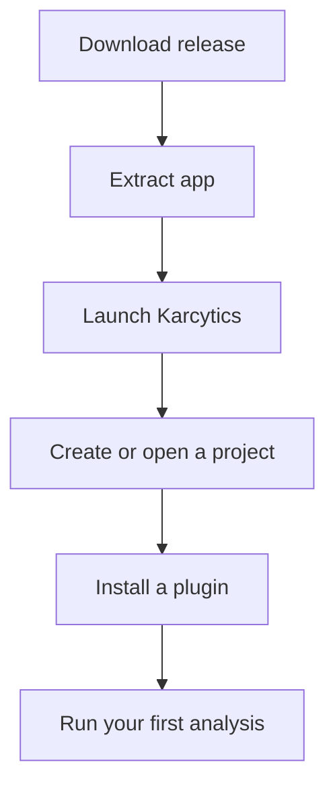

# Installation

Karcytics is distributed as a desktop application with a lightweight plugin ecosystem. Install the main app once, then add analysis modules from the in-app Plugin Store when you need them.

---

## Before you begin

Use the official GitHub release page for the latest download:

* [Karcytics Releases](https://github.com/KalaimaranB/Karcytics/releases)

Choose the build that matches your system:

* `Karcytics-Windows.zip` for Windows
* `Karcytics-macOS.tar.gz` for macOS

> [!NOTE]
> If you are running a source build or developer version, use the repository README and local setup instructions instead of the packaged app flow.

---

## Quick install summary

---

<strong>Windows installation</strong>

1. Download `Karcytics-Windows.zip` from the latest GitHub release.
2. Extract the ZIP to any location, for example `C:\Users\<you>\Documents\Karcytics`.
3. Open the extracted folder and double-click `Karcytics.exe` to launch the app.
4. If Windows SmartScreen shows a warning, choose **More info** and then **Run anyway** only if you trust the source.

> [!NOTE]
> Keep the extracted folder in a stable location. If you move or rename the app folder after installation, local plugin data and project settings may become harder to resolve.

### First launch on Windows

The first time you launch Karcytics, it creates application state in your home directory under `~/.karcytics`.

This folder stores:

* installed plugins
* trusted developer keys
* logs
* project history metadata

---

<strong>macOS installation</strong>

1. Download `Karcytics-macOS.tar.gz` from the latest GitHub release.
2. Double-click the downloaded file to unpack the `Karcytics.app` bundle.
3. Drag `Karcytics.app` into your **Applications** folder.
4. Open `Karcytics.app` from Applications.

### Gatekeeper / macOS security

On first launch, macOS may block the app because it is not signed through the App Store workflow.

Please follow these steps:

Do NOT click 'Move to Trash'! Instead, click 'Done'.

Open **System Settings** and click on **Privacy & Security**. Scroll down to the very bottom and click on **Open Anyway**.

You will be prompted here again. Make sure to click **Open Anyway**. You may be asked to authenticate yourself to allow the bypass. 

You might be asked to allow Karcytics access to the local network. Click **Allow** to allow Karcytics access so that the marketplace can function properly. 

> [!WARNING]
> Only override Gatekeeper when you downloaded Karcytics from the official repository and release page.

---

## Installing analysis modules

Karcytics itself is the host application. Analysis tools are delivered as plugins and installed inside the app.

1. Launch Karcytics.
2. From the Project Hub, click **Marketplace**.
3. Browse or search for a module.
4. Click **Install** to download and enable it.
5. Return to the home screen and launch the module from the installed list.

> [!TIP]
> The Plugin Store includes filters such as **All Modules**, **Available Updates** and **Installed**.

---

## Updating Karcytics and modules

Karcytics uses a split-update model:

* **Core app updates** are released from the GitHub Releases page. If you ever need to update your core app (you'll know by a banner in the hub), you will need to return to the releases page and follow the installation instructions. Make sure to delete the old core app before installing the new one! Your modules, preferences and other settings will not be affected.

* **Module updates** are handled from the Plugin Store. If you ever need to update a module, you can do so from the Plugin Store by clicking on marketplace and simply clicking update! 

### Core app update notifications

When the Project Hub starts, Karcytics checks for a new core version.

* If an update is available, a banner appears in the Hub.
* Click **Download Now** to open the latest release page.
* Click **Skip This Version** if you want to keep the current version temporarily.

---

## Supported platforms

Karcytics is primarily supported on modern Windows and macOS systems. Linux builds may be available through source or developer builds, but the main packaged experience is focused on Windows and macOS.

---

## Troubleshooting installation

If the app doesn't open:

* verify the archive extracted completely
* make sure `Karcytics.exe` or `Karcytics.app` is still present
* check your computer has permission to access the folder you extracted into

If a plugin won't install:

* confirm your internet connection
* check that the release page is reachable
* retry installation from the Plugin Store

> [!NOTE]
> Application logs are stored in `~/.karcytics/karcytics.log`. You can inspect them from the Help menu once Karcytics is running.

## What’s next?

* [Getting Started](02_Getting_Started.md) — create a project and learn the Hub
* [Plugin Store & Security](07_Plugin_Store_and_Security.md) — understand trust and module safety
* [FAQ & Troubleshooting](05_FAQ_Troubleshooting.md) — solve common problems quickly
