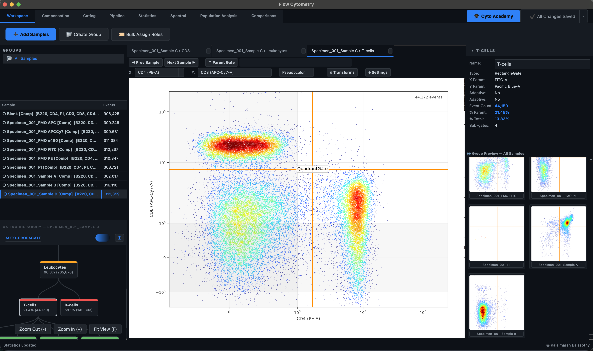

# Flow Cytometry — Overview

Karcytics' Flow Cytometry module takes you from raw instrument files (`.fcs`) all the way to publication-style statistics and figures — loading data, correcting for dye spillover, drawing gates around the cell populations you care about, and comparing them across samples — all inside one workspace.

This page is a map of that workspace. If you'd rather learn by doing than by reading, jump straight to the **[Academy](./10_ACADEMY_TUTORIALS.md)** — a set of built-in, hands-on tutorials that teach the whole module using real sample data Karcytics downloads for you.

!!! tip "New here?"
    The fastest way to get oriented is the in-app **Academy**. It walks you through loading files, compensation, and gating step by step, checking your actual work as you go — not just "click Next." See **[Academy & Guided Tutorials](./10_ACADEMY_TUTORIALS.md)**. Prefer a written walkthrough first? Start with **[Getting Started](./01_GETTING_STARTED.md)**.

## What this module does

- **Reads real instrument data** — native support for FCS 2.0, 3.0, and 3.1 files, with automatic channel and marker detection.
- **Displays fluorescence honestly** — true Logicle (biexponential) transforms, so compensated data that dips slightly negative still renders correctly instead of being clipped.
- **Corrects for dye spillover** — algorithmic compensation matrices computed from your single-stain controls, or extracted directly from a file's embedded calibration data.
- **Lets you draw any shape of gate** — Rectangle, Polygon, Ellipse, Quadrant, and Range gates, organized into a hierarchical gating tree.
- **Calculates the numbers you need** — 13+ statistical parameters per population (Count, % Parent, % Total, Median/MFI, CV, and more).
- **Shows your data six different ways** — Pseudocolor, Dot Plot, Contour, Density, Histogram, and CDF views of the same population.
- **Goes beyond manual gating** — UMAP dimensionality reduction with optional HDBSCAN clustering, so you can validate (or challenge) your manual gates with an unsupervised second opinion.

## How the workspace is laid out

Every screen in the module shares the same skeleton:

- **Tab bar** (top) — switches between the eight work areas described below. The **🎓 Cyto Academy** and **Save Workspace** buttons live at the right-hand end of this bar, always visible no matter which tab you're on.
- **Toolbar ribbon** (just under the tab bar) — a strip of buttons specific to whichever tab is active: importing files on Workspace, drawing tools on Gating, and so on.
- **Left sidebar** — the **Groups** panel, the **Sample List**, and the **Gating Hierarchy** tree, so you always know which samples exist and which populations you've already carved out of them.
- **Center canvas** — your plots. On most tabs this is a tabbed set of 2D graphs; on the Pipeline tab it becomes a flowchart of your gating strategy instead.
- **Right sidebar** — the **Properties Panel**, showing live statistics and settings for whatever sample or gate is currently selected.
- **Footer** — a thin status bar across the very bottom that quietly reports what just happened ("Samples loaded," "Gate created," "Compensation applied," …).

Four tabs — **Workspace**, **Compensation**, **Gating**, and **Pipeline** — keep this sidebar-plus-canvas arrangement and swap in their own ribbon. The other four — **Statistics**, **Spectral**, **Population Analysis**, and **Comparisons** — take over the full window as self-contained workspaces, hiding the sidebars entirely because they show data differently (tables, spectra, an analysis console, or comparison charts) rather than a per-sample plot.

<!-- SCREENSHOT: docs/images/user/overview/tab-bar-overview.png — close-up of the tab bar showing all eight tab labels plus the Academy and Save Workspace buttons on the right -->

## The eight tabs

### 1. Workspace
This is home base and almost always the first tab you'll touch. Import your `.fcs` files here, organize them into **Groups**, and tag each one with a **Role** (Unstained, Single Stain, FMO Control, Full Panel) so the rest of the module knows how to treat it. Everything downstream — compensation, gating, propagation — depends on decisions made on this tab.
→ [Workspace guide](./02_WORKSPACE.md)

### 2. Compensation
Fluorescent dyes leak a little light into their neighbors' detectors, and this tab is where that gets corrected. Karcytics can extract a spillover matrix straight out of a file's own metadata with one click, or compute one algorithmically from your Single Stain controls — then apply it to every sample at once. Compensated samples get marked with a small **[Comp]** tag so you always know at a glance whether you're looking at raw or corrected data.
→ [Compensation guide](./03_COMPENSATION.md)

### 3. Gating
The heart of the module. Draw Rectangle, Polygon, Ellipse, Quadrant, or Range gates directly on your plots to isolate the populations you care about, nested as deep as your biology requires. A live **Group Preview** shows your gate landing on every other sample in the group as you draw it, and an **Auto-Propagate** toggle controls whether that happens automatically.
→ [Gating guide](./04_GATING.md)

### 4. Pipeline
Your entire gating strategy, redrawn as a flowchart instead of a nested tree — the same view you'd screenshot to explain your analysis to a collaborator. Drag nodes around, reorient the whole layout, and build **AND / OR / NOT** logic nodes to combine populations — handy for cross-checking a manual gate against, say, an unsupervised cluster from Population Analysis.
→ [Pipeline guide](./05_PIPELINE.md)

### 5. Statistics
A dedicated, full-screen statistics explorer. Pick any combination of populations, samples, and metrics, and view the result as a sortable table or switch it to a Grouped Bar or Heatmap chart for an at-a-glance read.
→ [Statistics guide](./06_STATISTICS.md)

### 6. Spectral
An interactive viewer pulling real fluorophore excitation/emission spectra live from [FPbase](https://www.fpbase.org/), so you can see exactly why (or whether) two dyes in your panel actually overlap — hover between two curves for a real overlap-integral percentage. Its **Learning Compensation** sub-tab is a self-paced interactive slideshow that walks through spillover and matrix math using your own panel's real numbers.
→ [Spectral guide](./07_SPECTRAL.md)

### 7. Population Analysis
Where you step outside manual gating. Pick a root population and a set of channels, run **UMAP** to flatten your multi-dimensional marker data into a 2D map you can color by any channel, and optionally layer on **HDBSCAN** clustering to let the data group itself with zero manual input. Any resulting cluster can be exported straight back into your gating hierarchy as a real, usable population.
→ [Population Analysis guide](./08_POPULATION_ANALYSIS.md)

### 8. Comparisons
Five dedicated chart types for putting populations and samples side by side: Violin, Channel Heatmap, Radar, and Histogram Overlay (with a Ridge alternative for a handful of series) — each one better suited to a different kind of question than a plain statistics table.
→ [Comparisons guide](./09_COMPARISONS.md)

## Learn by doing: the Academy

Every capability described above is also taught hands-on, inside the app, by the **Academy** — three structured courses that walk you through real UI interactions with on-screen spotlighting, live checks against what you've actually done (not just "click Next"), and their own demo data so you don't need a dataset of your own to get started.

<!-- SCREENSHOT: docs/images/user/overview/academy-button.png — close-up of the 🎓 Cyto Academy button in the top-right of the tab bar -->

→ [Academy & Guided Tutorials](./10_ACADEMY_TUTORIALS.md)

## Where to go next

- **[Getting Started](./01_GETTING_STARTED.md)** — a written, step-by-step walkthrough from loading your first file to saving your first workflow.
- **[Academy & Guided Tutorials](./10_ACADEMY_TUTORIALS.md)** — the interactive alternative, complete with sample data.
- **[Scientific Logic](./11_SCIENTIFIC_LOGIC.md)** — the mathematics behind the transforms, compensation, and statistics, for readers who want the underlying rationale.
