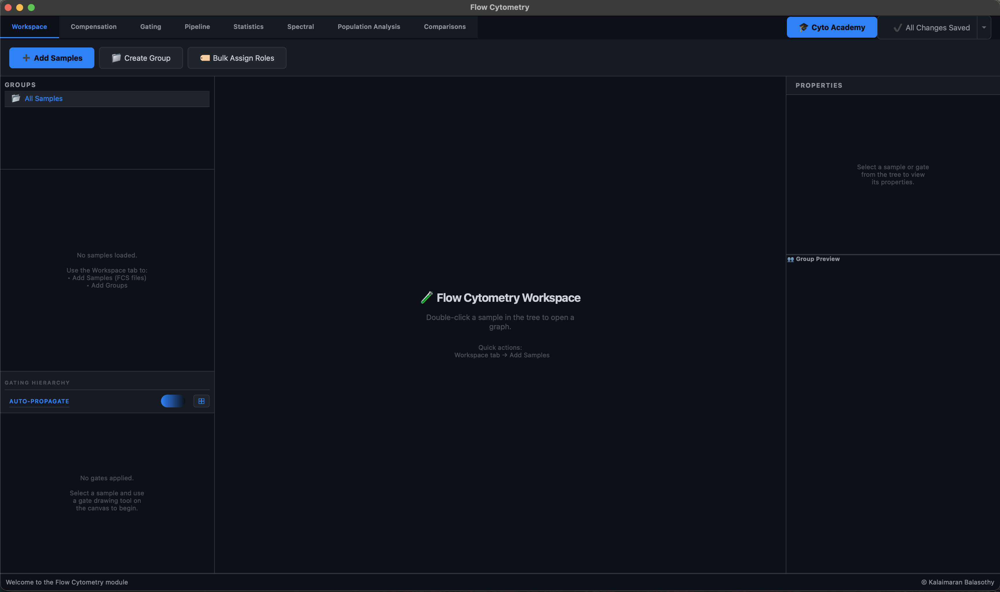
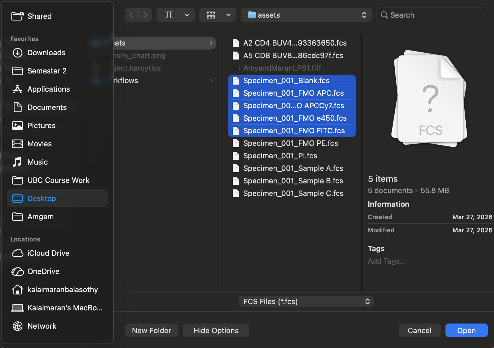
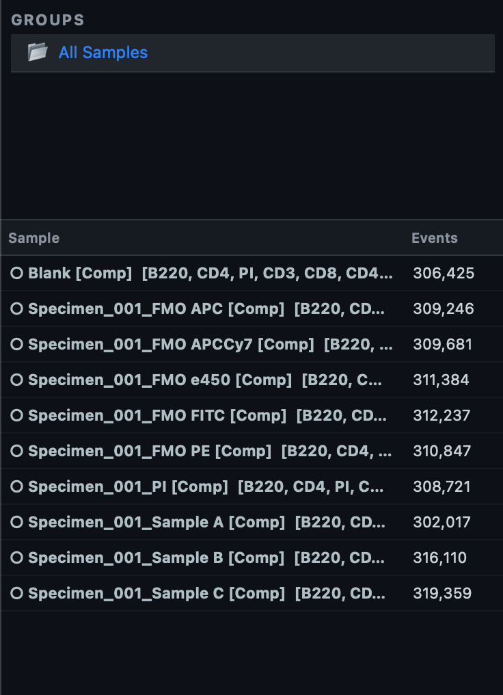
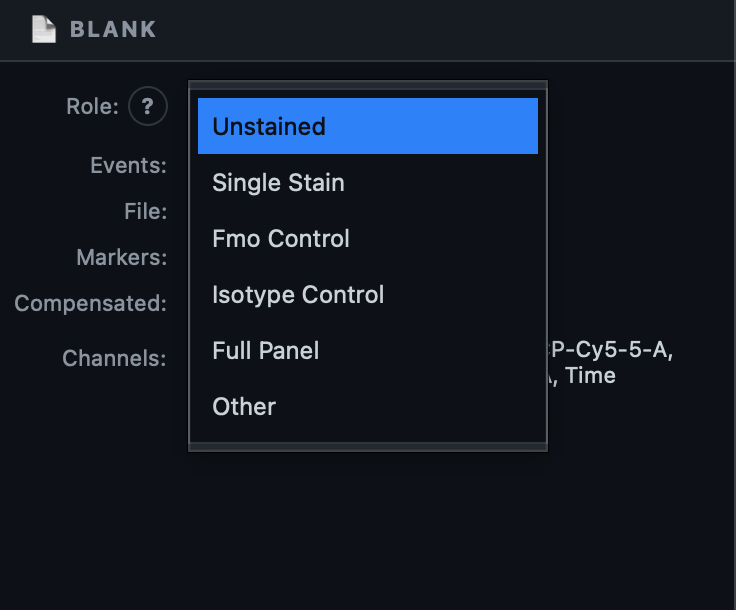
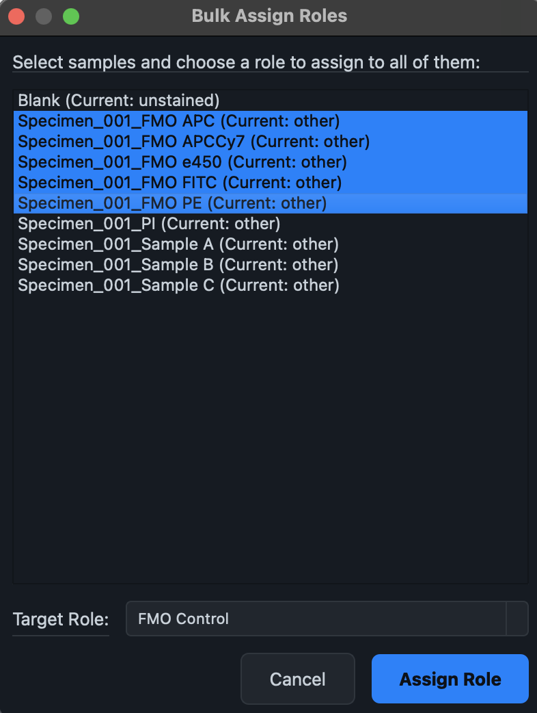

# Getting Started

!!! tip "The fastest way to learn: the Academy"
    Before reading any further, consider clicking the **🎓 Cyto Academy** button in the top-right of the tab bar. It opens **Flow Cytometry Fundamentals**, a guided, hands-on course that walks you through everything on this page — loading files, compensation, and your first gating hierarchy — using its own demo data, with Karcytics checking your actual work at every step. See **[Academy & Guided Tutorials](./10_ACADEMY_TUTORIALS.md)** for details on what each course covers.

If you'd rather read through the workflow first (or you're working with your own data right away), this guide walks the same path in writing — the same sequence Course 1 of the Academy teaches, minus the spotlighting and automatic checks.

## What you'll need

Any `.fcs` file (FCS 2.0, 3.0, or 3.1) will load. To follow every step below — including compensation and boundary-based gating — you'll ideally have:

- One **Unstained** control (no dye — establishes autofluorescence baseline).
- One or more **Single Stain** controls (one fluorophore each — used to compute spillover).
- One **FMO (Fluorescence Minus One)** control per marker you plan to gate on — every dye except that one, so you can see exactly where true background ends.
- Your actual experimental samples.

You can still follow along with just your experimental files — you'll simply skip the compensation and FMO-boundary steps.

## Step 1 — Load your FCS files

Make sure you're on the **Workspace** tab (the leftmost tab), then click **➕ Add Samples** in the ribbon.

1. A file picker opens — select all the `.fcs` files you want to work with (multi-select is supported).
2. If any of the files live outside your current project folder, Karcytics asks whether to copy them into the project's own `assets` folder. Say yes if you want the project to stay portable and self-contained.
3. A progress dialog tracks the load. Once it finishes, your files appear in the **Sample List** on the left, and the footer bar confirms how many samples loaded.

!!! tip "Compensation might already be done for you"
    If a file has a `$SPILL` keyword embedded in its header (common for data exported from acquisition software), Karcytics extracts and applies that spillover matrix to every sample automatically the moment they're loaded. Look for a small **[Comp]** tag next to a sample's name in the Sample List — that's your sign it's already compensated. If you don't see it, you'll build a matrix by hand in Step 3.

## Step 2 — Understand Groups

Before assigning roles, glance at the **Groups** panel above the Sample List. Every sample you just imported sits in one default group, **All Samples**. A group is simply a named subset of your samples, and it controls something important: gates you draw on one sample only propagate automatically to *other samples in the same group*.

For most single-experiment work, the default group is all you need — you don't have to create a custom one. Reach for **📁 Create Group** only when you're mixing tissue types or experiments that genuinely need different gating strategies, so their gates don't interfere with each other.

## Step 3 — Tag every sample with a Role

Roles tell Karcytics what each file *is*, which drives compensation math and boundary detection later. The core roles are:

| Role | Meaning |
|---|---|
| **Unstained** | No dye — establishes the autofluorescence baseline |
| **Single Stain** | One dye only — used to compute the spillover matrix |
| **FMO Control** | Every dye except one — reveals the true background for that marker |
| **Full Panel** | A real experimental sample, fully stained |
| **Isotype Control** | Validates antibody specificity |

To assign roles one at a time: double-click a sample in the **Sample List** to open it, then use the **Role** dropdown in the **Properties Panel** on the right.

For multiple samples that share a role (all your FMO controls, for instance), it's faster to use **🏷️ Bulk Assign Roles** in the Workspace ribbon — select every file that shares a role, set it once, and click Assign.

## Step 4 — Set up compensation

Switch to the **Compensation** tab.

If Karcytics already auto-applied an embedded matrix in Step 1, every sample already carries its **[Comp]** tag — you can still walk through this tab to see (and verify) exactly what was applied:

1. Click **📄 Extract from FCS** — this reads the `$SPILL` keyword from the first file that has one and opens a dialog showing the extracted matrix values (the diagonal is normally 1.0; off-diagonal values show how much light spills between detectors).
2. Click **✅ Apply to All** to apply it across every sample. If it's already applied, Karcytics simply tells you the samples were skipped because they're already compensated.

<!-- SCREENSHOT: docs/images/user/getting-started/compensation-matrix-dialog.png — the extracted spillover matrix dialog, showing a grid of channel-by-channel values with a strong diagonal -->

If none of your files carry an embedded matrix, tag your Single Stain controls with their role in Step 3 first — Karcytics uses exactly those controls to compute a spillover matrix algorithmically, the same math described in [Scientific Logic](./11_SCIENTIFIC_LOGIC.md).

!!! note
    Compensation never touches the scatter channels (FSC/SSC) — only fluorescence detectors carry dye spillover.

## Step 5 — Build your first gates

Switch to the **Gating** tab, where the Rectangle, Polygon, Ellipse, Quadrant, and Range drawing tools live in the ribbon.

### 5a. Isolate real cells from debris

Open your **Unstained** (or otherwise dye-free) sample by double-clicking it in the Sample List — it's the best baseline because with no dyes involved, differences on the plot come down purely to physical size and complexity. The plot opens by default on **FSC-A** (Forward Scatter — roughly cell size) vs. **SSC-A** (Side Scatter — roughly internal complexity).

<!-- SCREENSHOT: docs/images/user/getting-started/fsc-ssc-plot.png — the FSC-A vs SSC-A pseudocolor plot on an unstained sample, showing a dense oval cell cluster and a smaller debris cloud near the origin -->

Select the **Polygon** tool, click around the main cell cluster to trace it (excluding the debris cloud, usually near the bottom-left corner), double-click to close the shape, and name it something like **Cells** when prompted.

<!-- SCREENSHOT: docs/images/user/getting-started/cells-gate-drawn.png — the polygon "Cells" gate outlined on the FSC-A/SSC-A plot, now appearing as a new node in the Gating Hierarchy panel -->

Once it's drawn, it appears immediately in the **Gating Hierarchy** panel on the left, and — because Auto-Propagate is on by default — it's copied to every other sample in the same group in the background.

### 5b. Gate live cells with a viability marker

If you have a viability dye (e.g. a single-stain propidium iodide/PI control), open that sample next. Set the X axis to that dye's detector channel using the **X:** dropdown above the plot.

Two things happen automatically: Karcytics opens the sample directly at your **Cells** population (it always preserves your gating context between samples), and the axis switches itself to **Biexponential** — because compensated fluorescence data can legitimately dip slightly negative, and only a biexponential (Logicle) scale displays that correctly.

<!-- SCREENSHOT: docs/images/user/getting-started/viability-biexponential-plot.png — a viability-channel histogram/plot on Biexponential scale, showing a dim (live) population and a brighter (dead) population -->

!!! tip "Seeing a clipped edge?"
    By default the plot trims the extreme 0.1% of outliers so a stray spike doesn't blow out your scale. If a population looks cut off at the edge, open **⚙ Transforms** and set **Outliers** to **0%** to see the full tail.

Select the **Range** tool and drag across the dim (live) population to capture it, then name the gate something like **Live Cells**. Nest it under **Cells** by drawing it while that population is open — the hierarchy tracks parent/child relationships automatically.

### 5c. Anchor a marker gate to a true background (FMO)

For any lineage marker you want to gate on, open its matching **FMO Control** first — since it contains every dye except that one, any signal it shows in that marker's channel is pure background, not staining.

<!-- SCREENSHOT: docs/images/user/getting-started/fmo-background-plot.png — the FMO control sample plotted with the marker channel on X, showing a dense negative cluster and a faint autofluorescence tail with no real positive population -->

Draw a gate (typically **Rectangle** or **Range**) that starts just past that background tail — since this sample has zero real signal for the marker, everything in view genuinely *is* background, so you can set the boundary with confidence before ever looking at a stained sample. Watch the **Group Preview** panel (bottom-right of the Properties Panel) as you draw — it live-previews the same gate landing on every other sample in the group.

Then open a real stained sample to confirm: the exact same boundary should now separate the negative cluster from a clear positive population.

<!-- SCREENSHOT: docs/images/user/getting-started/group-preview-panel.png — the Group Preview panel showing small thumbnail plots of several other samples, each with the new gate already drawn on them -->

!!! note "The axes won't jump around on you"
    The first time you pick a channel for an axis, Karcytics calculates the zoom once and then locks it for that channel across every sample in the group. That's deliberate — it means switching between controls and real samples never re-zooms or jumps the view out from under you.

## Step 6 — Check your statistics as you go

With any gate selected in the Gating Hierarchy, the **Properties Panel** on the right shows its live statistics: **Event Count**, **% Parent** (share of its immediate parent population), and **% Total** (share of the whole tube), updating instantly as you refine the gate shape.

<!-- SCREENSHOT: docs/images/user/getting-started/properties-panel-stats.png — the Properties Panel showing event count, % Parent, and % Total for a selected gate -->

For a broader view across every sample and population at once, see the [Statistics guide](./06_STATISTICS.md).

## Step 7 — Save your workflow

Once you have a gating hierarchy you're happy with, click the **Save Workspace** button in the top-right of the tab bar, next to the Academy button.

- The first time you save, a small dialog asks for a name (and optional description) for the workflow.
- After that, the same button updates your saved workflow in place — it visually indicates when you have unsaved changes, so you always know whether it's safe to close the workspace.

<!-- SCREENSHOT: docs/images/user/getting-started/save-workspace-dialog.png — the Save Workspace naming dialog with a workflow name entered -->

Your saved workflow — every sample, group, role, compensation matrix, and gate — can be reopened later from your Karcytics project, exactly as you left it.

## Where to go next

- **[Workspace](./02_WORKSPACE.md)**, **[Compensation](./03_COMPENSATION.md)**, and **[Gating](./04_GATING.md)** — deeper detail on each tab you just used.
- **[Pipeline](./05_PIPELINE.md)** — see your gating strategy as a flowchart instead of a tree.
- **[Statistics](./06_STATISTICS.md)** and **[Comparisons](./09_COMPARISONS.md)** — once you have more than one gate, these are where the real analysis happens.
- **[Academy & Guided Tutorials](./10_ACADEMY_TUTORIALS.md)** — Course 2 and Course 3 pick up exactly where this guide leaves off, building immunophenotyping, Pipeline mastery, statistics, and unsupervised population analysis on top of the workflow you just saved.
