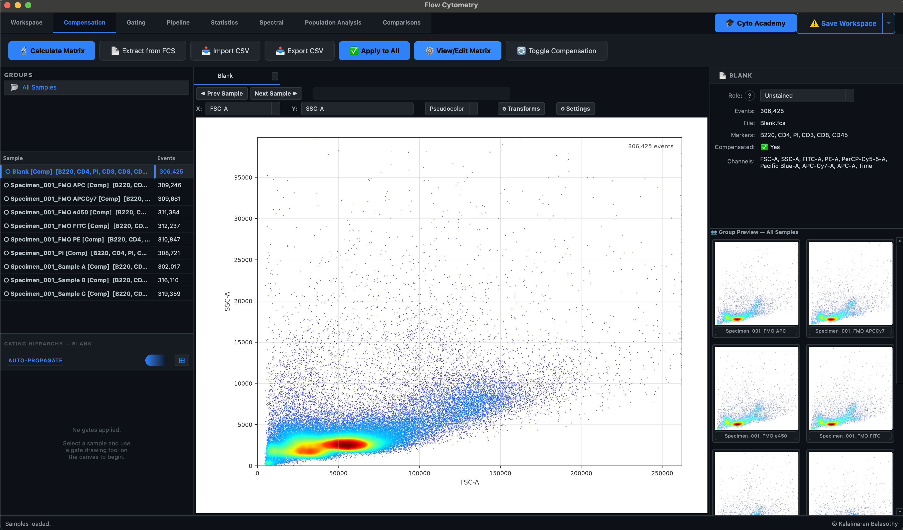
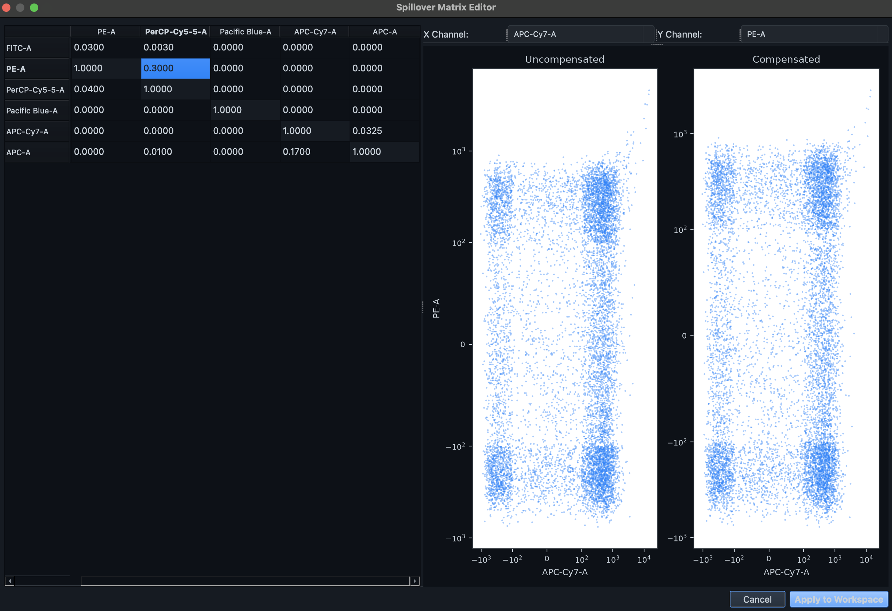

# Compensation

Spectral compensation computationally isolates target fluorophore emissions by mathematically eliminating signal bleed-through from overlapping spectral signatures. The **Compensation** ribbon provides a robust, algorithm-driven environment for generating, reviewing, and applying high-dimensional spillover matrices.

## 1. Matrix Computation & Extraction

Karcytics provides multiple avenues to obtain a compensation matrix for your dataset:

### Calculate from Controls
Before computation, strict taxonomic roles must be assigned to your control samples within the Workspace Properties Panel (**Unstained Control** and **Single Stain**). The computational engine automatically scans all designated `Single Stain` samples and maps the primary emission channel exhibiting the highest intensity variance.

1. Navigate to the **Compensation** ribbon tab.
2. Click **🔬 Calculate Matrix**.
3. The module computes the orthogonal $N \times N$ spillover matrix via linear algebra.

### Extract from FCS Metadata
Many modern acquisition cytometers embed the acquisition-time compensation matrix directly within the FCS file's metadata.
- Click **📄 Extract from FCS** to scan loaded samples for the `$SPILL` or `$SPILLOVER` keyword and automatically load the embedded matrix into your workspace.

### Import from File
If you have computed your matrix using external tools (like FlowJo or R):
- Click **📥 Import CSV** to load a matrix from standard `.csv`, `.tsv`, or `.txt` formats.

## 2. Reviewing the Matrix

Once a matrix is loaded or computed, it is vital to review it for excessive spectral overlap.

1. Click **⚙️ View/Edit Matrix** to open the Compensation Editor.
2. Inspect the off-diagonal coefficients. You can also view side-by-side scatter plots to fine-tune specific channel interactions manually.

!!! warning
    High spillover values (typically $>50\%$) indicate severe spectral overlap, which may compromise population resolution. If you observe excessive values, consider redesigning your panel or referencing the **Spectral Ribbon** to analyze the physical overlaps.

## 3. Matrix Application

Matrix computation does not destructively alter the raw `.fcs` event data. 

- **Apply to All**: Click **✅ Apply to All** to project the inverted compensation matrix onto your biological datasets. All active visualizations will synchronously refresh to reflect the compensated geometry.
- **Toggle Compensation**: Use the **🔄 Toggle Compensation** button to quickly flip back and forth between raw and compensated states across all samples. This is highly useful for verifying that your matrix has resolved the spectral overlaps without overcompensating (resulting in "bowing" populations).

## 4. Matrix Export

Once verified, the active compensation matrix can be exported by clicking **📤 Export CSV**. This allows you to standardize the matrix for downstream computational pipelines or documentation in publications.
