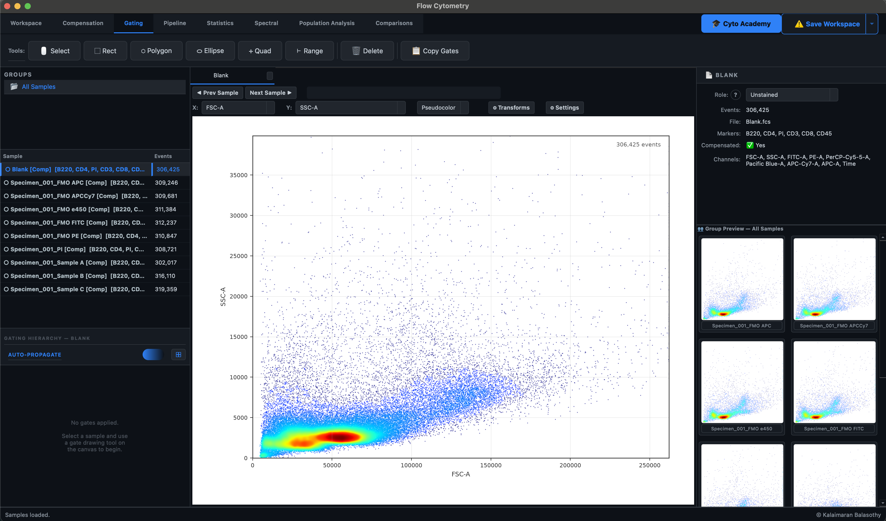
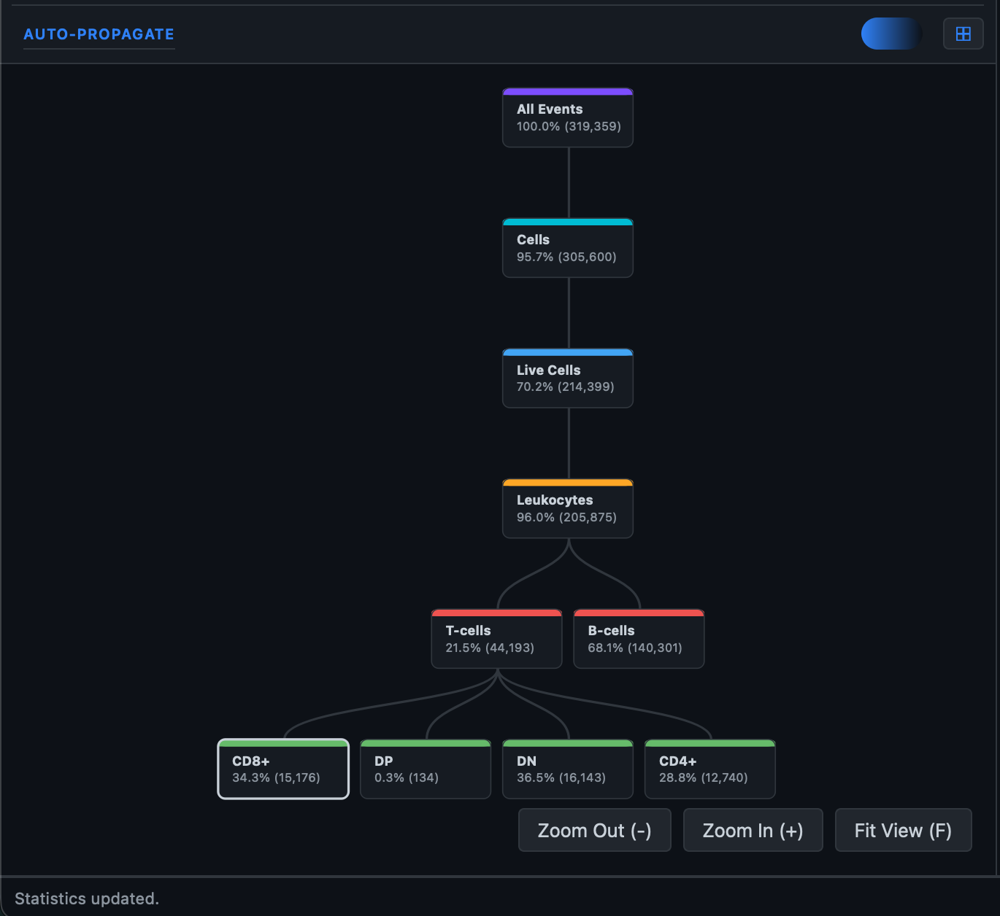

# Gating

Gating is the fundamental process of defining sub-populations within your flow cytometry data. The **Gating** ribbon provides access to a suite of advanced geometric gating tools that go far beyond standard orthogonal rectangles.

## 1. Advanced Geometric Gating

Karcytics supports complex geometric constraints tailored to isolate distinct cellular morphologies and fluorescent phenotypes. Select a tool from the ribbon and interact with any active plot:

- **🖱 Select**: The default pointer mode. Use this to click on existing gates to resize or move them.
- **⬚ Rectangle**: Click and drag to draw a standard rectangular gate.
- **⬡ Polygon**: Sequentially click to define vertices on the plot; double-click or press `Enter` to finalize the polygon. Optimal for isolating non-standard morphological populations (e.g., specific myeloid subsets).
- **⬭ Ellipse**: Click and drag to instantiate an elliptical region. Computationally optimal for isolating tightly clustered populations distributed across logarithmic coordinate spaces.
- **✛ Quad**: Click to instantiate a bifurcating origin point that divides the coordinate space into four distinct quadrants (e.g., $CD4^+/CD8^-$, $CD4^-/CD8^+$, $CD4^+/CD8^+$, and $CD4^-/CD8^-$).
- **⊢ Range**: Click and drag horizontally to draw a 1-dimensional range gate (ideal for histograms).

## 2. Gate Management & Propagation

Once a geometric gate is drawn on a plot, it defines a new mathematical subset of the parent data. 

### Navigating the Hierarchy
- **Child Populations**: Selecting a child gate within the **Sample Tree** (left panel) will actively filter downstream events. Any plots instantiated from that node will only display the gated sub-population.
- **Hierarchical Structuring**: By sequentially drawing gates on child populations, you build a structural hierarchy of your data.

### Managing Gates
- **🗑 Delete**: Select a gate on a plot (using the Select tool) and click Delete in the ribbon to remove it and its children.
- **📋 Copy Gates**: After perfecting a gating hierarchy on a representative sample, click Copy Gates to automatically propagate the structural hierarchy to all other samples within the same Group.

!!! tip
    While spatial gating is powerful, biological logic often requires more than simple spatial overlap. To incorporate boolean logic (AND, OR, NOT) or to merge populations from different spatial hierarchies, utilize the **Pipeline** ribbon.
