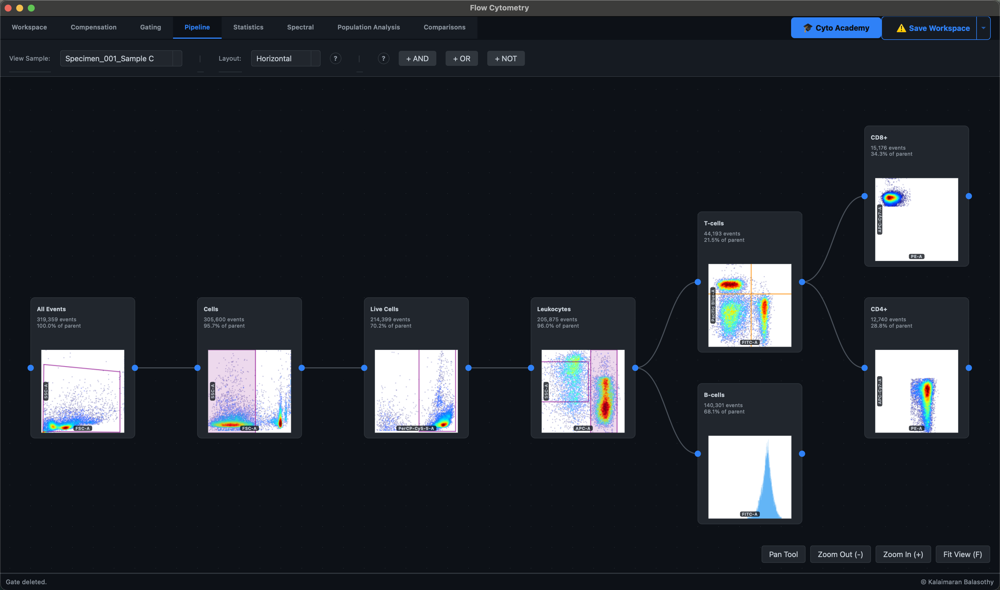

# Pipeline Ribbon Guide

Karcytics features an advanced visual node-based pipeline for constructing complex gating strategies. The **Pipeline Ribbon** transitions your workspace into a powerful visual programming environment.

## 1. Accessing the Pipeline

1. Navigate to the **Pipeline** ribbon tab.
2. The central workspace will switch to the infinite **Node Canvas**.
3. Use the **Pan Tool** (or click and drag with the middle mouse button) to navigate the workspace. Use the zoom controls or press `F` to auto-fit the view to your nodes.

## 2. Logic Nodes

Instead of purely spatial geometric gates (which are handled in the Gating Ribbon), you can incorporate mathematical boolean logic:
- **AND Gate**: Yields the intersection of multiple parent populations.
- **OR Gate**: Yields the union of multiple parent populations.
- **NOT Gate**: Yields the inverse of a single parent population.

To add a logic node, simply click the corresponding button in the Pipeline ribbon.

## 3. Wiring and DAG Architecture

Because the gating system uses a Directed Acyclic Graph (DAG), populations can have multiple parents. This is essential for complex logic such as identifying cells that express *either* Marker A or Marker B, but *not* Marker C.

- **Connect**: Click and drag from the output port of a parent node to the input port of a child or logic node.
- **Disconnect**: Click on any wire connecting two nodes (it will highlight in blue) and press the `Delete` or `Backspace` key to sever the connection.
- **Double-Click**: Double-clicking any node in the pipeline will instantly flip the workspace back to the spatial graph view for that specific population, allowing you to seamlessly switch between structural architecture and spatial refinement.
