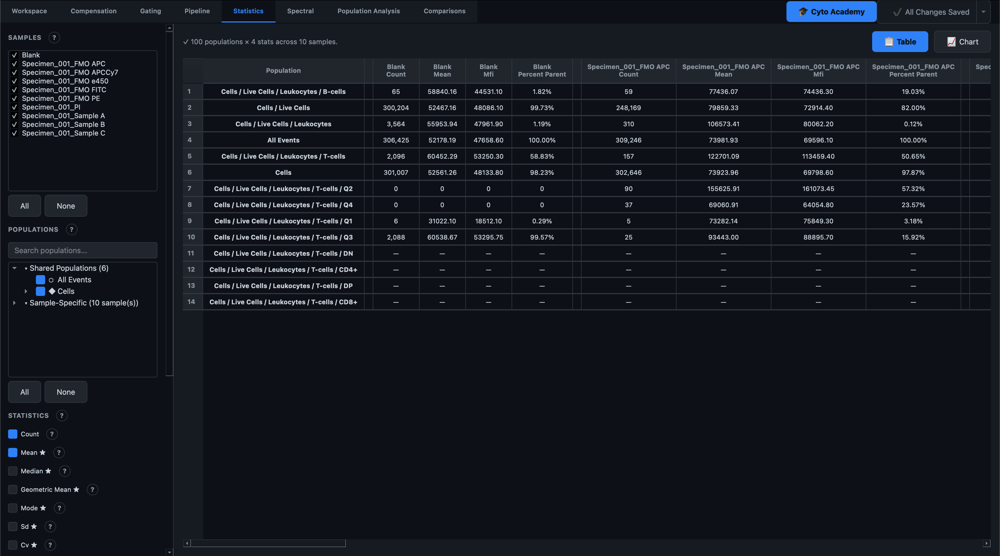

# Statistics

The **Statistics** tab is a dedicated, full-screen workspace for turning your gated populations into numbers. Where a plot lets you *see* that one sample looks brighter than another, the Statistics tab lets you *quantify* exactly how much brighter, across as many samples and populations as you like, and export the result for downstream analysis in Python, R, or Prism.

This tab has no ribbon toolbar above it — every control lives in the left-hand panel of the workspace itself.

## 1. Choosing what to analyze

The left sidebar walks top-to-bottom through everything needed for a computation.

**Samples and populations** share one selector at the top of the panel:

- Check one or more **samples** — each checked sample becomes its own column group in the results table.
- Check one or more **populations** (gates) from the tree below it. Populations are split into **Shared Populations** — gates present under the same name in every checked sample, typically the result of propagating a gating strategy across a group — and **Sample-Specific** populations, which don't line up across every checked sample. Check **All Events** to include the whole ungated sample as a row.

<!-- SCREENSHOT: docs/images/user/statistics/sample-population-selector.png — the sample checklist and the Shared/Sample-Specific population tree -->

!!! tip
    Selecting multiple samples and multiple populations at once builds a single combined table — you don't need to run the computation once per sample.

## 2. Selecting statistics

Below the selector is a checklist of every statistic the tab can compute. By default **Count**, **% Parent**, and **MFI** are pre-checked, since they're the three numbers most researchers reach for first.

| Statistic | What it measures | Needs a channel? |
|---|---|---|
| Count | Total number of events in the population | No |
| Mean | Arithmetic average fluorescence intensity | Yes |
| Median | 50th-percentile fluorescence intensity | Yes |
| Geometric Mean | Average of the log-transformed values | Yes |
| Mode | The most frequent value (histogram peak) | Yes |
| SD | Standard deviation — absolute spread of the data | Yes |
| CV | Coefficient of variation (SD ÷ mean, as %) — peak sharpness | Yes |
| MFI | Median Fluorescence Intensity — same value as Median, phrased for expression comparisons | Yes |
| % Parent | Fraction of events relative to the immediate parent gate | No |
| % Grandparent | Fraction of events relative to the parent's parent | No |
| % Total | Fraction of events relative to the entire (ungated) sample | No |
| Min | Lowest channel value in the population | Yes |
| Max | Highest channel value in the population | Yes |

Every checkbox has its own help icon with guidance on when to use it — for example, Mean is flagged as unsuitable for log-scaled fluorescence data (a few bright outliers skew it badly), where Median or Geometric Mean are recommended instead.

Statistics marked with a **★** in the checklist need a channel to compute — you'll select that channel in the next step.

<!-- SCREENSHOT: docs/images/user/statistics/stat-checklist.png — the statistics checklist with the star markers and a help tooltip open -->

## 3. Picking a channel

If any ★-marked statistic is checked, choose the fluorescence channel it should be computed on from the **Channel** dropdown. This one channel applies to every ★ statistic in the run — to get MFI for two different markers, run Compute twice with a different channel selected each time (the results table will simply grow with more columns to compare).

## 4. Computing

Click **Compute Statistics** to run. The calculation happens on a background thread, so the interface stays responsive — you can keep working while a large multi-sample computation finishes. A thin progress indicator appears above the button while it runs, and the status line at the top of the results panel reports how many populations, statistics, and samples were processed once it completes.

## 5. Reading the results

Results land in a **Table** view by default: one row per population, with each checked sample forming its own group of columns — one column per statistic, separated by a thin colour-coded divider bar so it's unambiguous where one sample's numbers end and the next begin.

- Right-click any row for a context menu to copy selected rows, copy the whole table, or export to CSV.
- **Copy All** and **Export CSV** in the sidebar do the same for the entire table without needing to select rows first.

<!-- SCREENSHOT: docs/images/user/statistics/results-table.png — a populated results table with multiple sample column groups and the colour-coded separators visible -->

### Chart view

Switch to **Chart** using the toggle above the results area to visualize one statistic at a time instead of reading raw numbers. Three chart types are available from the dropdown:

- **Grouped Bar** — one cluster of bars per population, one bar per sample.
- **Horizontal Bar** — the same comparison rotated, useful when population names are long.
- **Heatmap** — populations as rows, samples as columns, colour-coded by value with the number annotated in each cell.

Use the stat dropdown next to the chart-type picker to choose which statistic is plotted (only statistics you actually computed are available). Export the chart to PNG or SVG with the **Export** button in the toolbar — matplotlib renders at 300 DPI, suitable for figures.

<!-- SCREENSHOT: docs/images/user/statistics/chart-view-heatmap.png — the Chart view showing the Heatmap option with population rows and sample columns -->

!!! warning
    The chart and export actions always use the data from the last time you clicked **Compute Statistics** — if you check a new sample or population afterward without recomputing, the chart won't include it. Recompute after changing your selection.

## Why this instead of reading the plot?

A gating plot is built to show you the *shape* of a population — where it sits, whether it's cleanly separated from its neighbors. It isn't built to answer "is CD69 up 2-fold in the treated group?" precisely, because eyeballing a histogram's peak or spread is imprecise and impossible to report reproducibly. The Statistics tab computes the same numbers a peer reviewer would want to see — MFI, CV, % Parent — directly from the underlying event data, tied to the exact gate you selected, and ready to paste into a manuscript table or hand to a statistics package for hypothesis testing.
