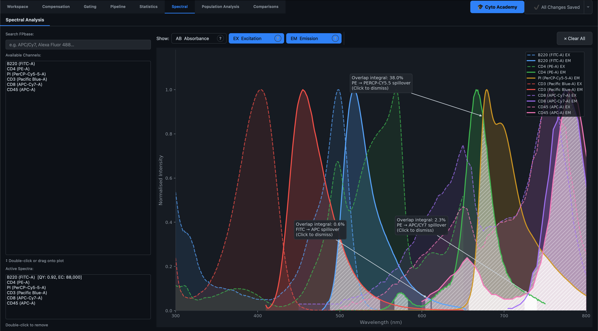
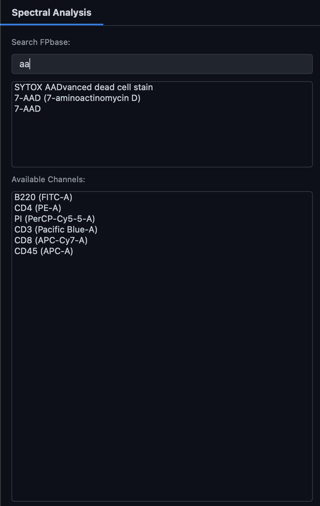
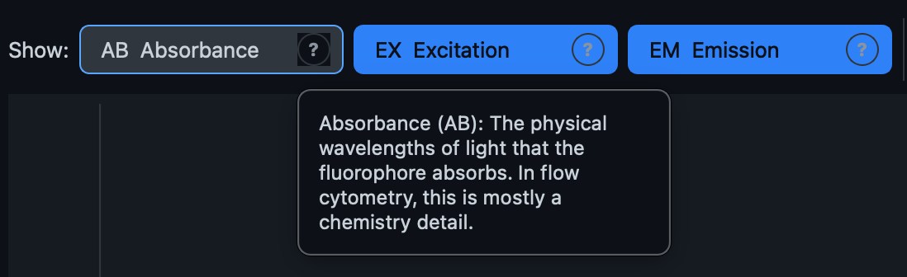

# Spectral

The **Spectral** tab is a self-contained workspace for evaluating fluorophore spectra — independent of any loaded sample's gating hierarchy. It answers the question you should ask *before* you run a panel, not after: "will these dyes' emission spectra bleed into each other badly enough to cause a problem?"

The tab has no ribbon toolbar; every control lives inside the workspace itself, split across two inner tabs: **Spectral Analysis** and **Learning Compensation**.

## Spectral Analysis

### Adding fluorophores to the plot

There are three ways to add a dye's spectrum to the plot:

- **Double-click** a channel in the **Available Channels** list, which is auto-populated from every currently loaded sample's real detector panel (channels are de-duplicated across samples, and scatter/time channels are excluded).
- **Drag** a channel from that same list directly onto the plot area.
- **Search FPbase** by typing a dye name (e.g. "APC/Cy7", "Alexa Fluor 488") into the search box — an autocomplete list appears as you type, and clicking a result adds it.

The first time you open the tab with real channel data available, every detected channel is plotted automatically so you're never staring at an empty canvas — clearing the plot afterward with **Clear All** won't trigger that auto-fill again.

Each added dye appears in the **Active Spectra** list with a colour swatch and, where FPbase provides the data, **QY** (Quantum Yield) and **EC** (Extinction Coefficient) chips — both relevant to how bright a dye will actually appear on your instrument. Double-click an entry in that list to remove it.

!!! tip
    Common naming mismatches between your FCS channel names and FPbase's dye names (e.g. "APC-Cy7" vs "APC/Cy7", "PerCP-Cy5-5" vs "PerCP-Cy5.5") are resolved automatically when you drag or double-click from the channel list.

### Reading the curves

Three curve types can be toggled independently with the **AB / EX / EM** buttons above the plot:

- **AB (Absorbance)** — the wavelengths of light the dye absorbs; mostly a chemistry detail, shown dotted and faint.
- **EX (Excitation)** — the wavelengths that make the dye fluoresce; use this curve to pick which laser line to excite it with. Shown dashed.
- **EM (Emission)** — the wavelengths the dye emits back; use this curve to pick which detector should capture it. Shown solid, and this is the curve used for the overlap analysis below. On by default alongside EX.

### Spectral overlap evaluation

Whenever two or more dyes have their Emission curves visible, the plot automatically shades every pairwise region where both curves are meaningfully above zero, and drops a callout at the peak of the shaded region reporting the overlap as a percentage. This is the same overlap calculation used by the Learning Compensation tab, so the number you see here is directly comparable to what that tutorial teaches.

Click a callout to dismiss it if it's blocking your view of the curves underneath — this only hides that one annotation, and it reappears if you reopen the tab.

!!! tip "Panel design"
    Use this view before you commit to a panel, not after you've already stained cells. Two dyes with peaks 50 nm apart can still overlap 20–30% or more — if the overlap is heavy, either accept that compensation will be doing real work on that pair, or put the two dyes on markers you're confident will never both be positive on the same cell.

!!! tip "The Golden Rule of panel design"
    Compensation can correct the *average* leakage between two dyes, but heavy spectral overlap still increases noise (spreading error) in the corrected data. The best fix for two heavily overlapping dyes is not a bigger compensation matrix — it's assigning them to markers that are never expected to be positive on the same cell.
