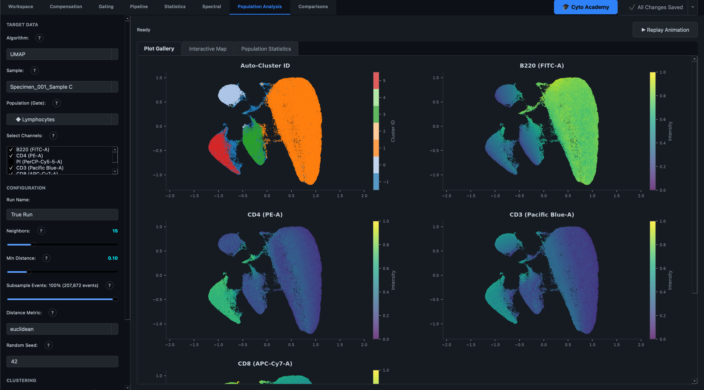
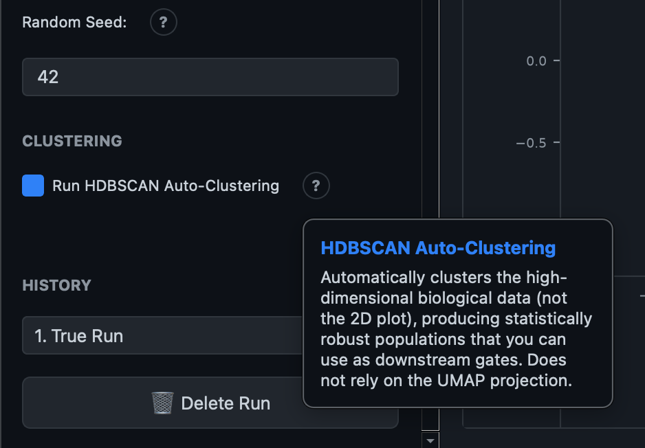
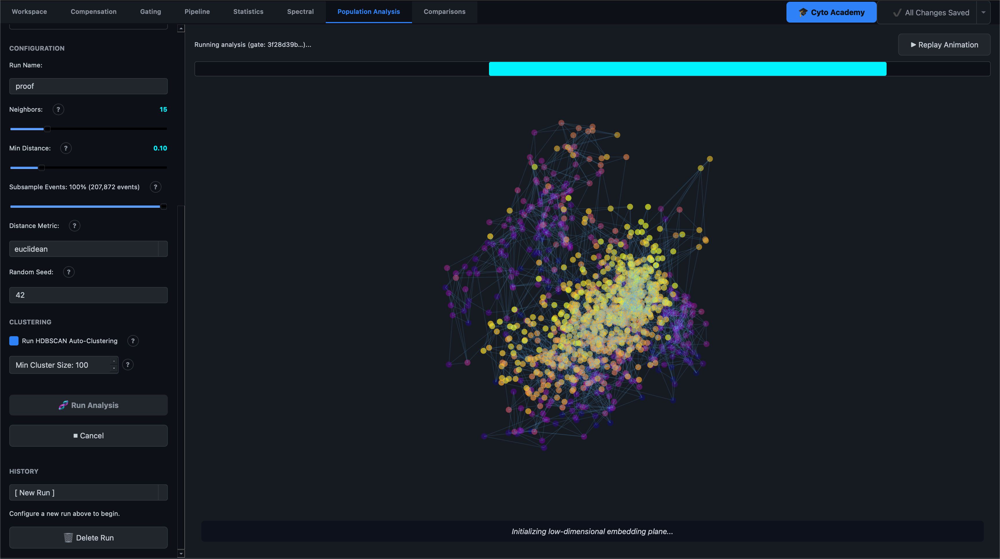
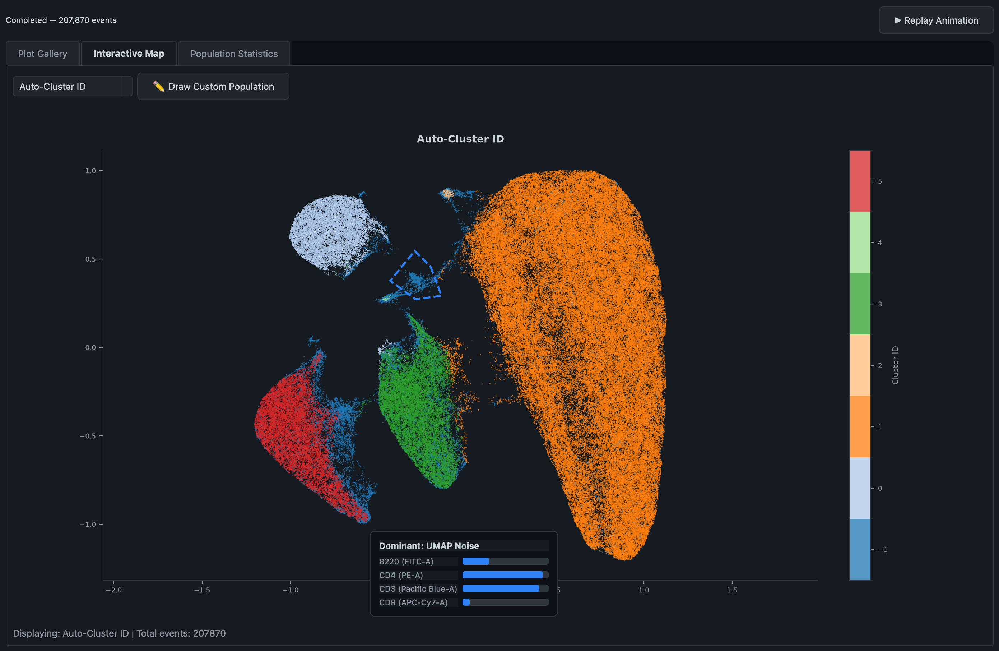
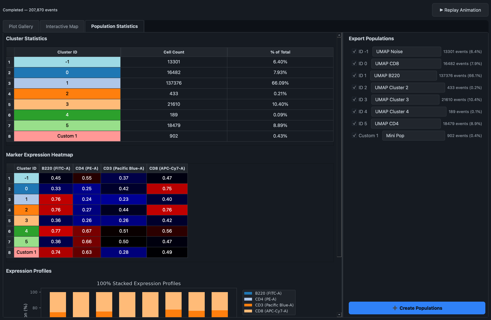

# Population Analysis

The **Population Analysis** tab runs UMAP (Uniform Manifold Approximation and Projection) — a dimensionality-reduction algorithm that takes every marker you measured on a cell and projects it down onto a single 2D map. Cells that look similar across all their markers land near each other; cells that look different land far apart. It's a way of exploring structure in your data — continuous gradients, rare sub-populations, unexpected clusters — without deciding in advance where the gates should go.

This tab has no ribbon toolbar. Every control lives in the left panel of the workspace, which mirrors the same layout pattern as Statistics and Comparisons: a fixed sidebar for configuration, and a right-hand workspace for results.

## 1. Configuring a run

### Target data

- **Algorithm** — currently UMAP is the only option.
- **Sample** — the sample to analyze.
- **Population (Gate)** — optionally restrict the analysis to a specific gated population rather than the whole sample. This is strongly recommended: running UMAP on ungated debris and dead cells distorts the projection, so gating out Live/Singlets first and running UMAP on that population gives a much cleaner map.
- **Select Channels** — the fluorescence parameters fed into the reduction. Uncheck anything already used for gating upstream (viability dyes, scatter parameters) — they add noise rather than useful biological variance to the clustering.

### Run parameters

| Parameter | What it controls |
|---|---|
| Run Name | A label for this run, shown in the Run History dropdown afterward |
| Neighbors | Balance between local and global structure. Lower (5–15) emphasizes fine local clusters; higher (30–50) preserves broader relationships between distant cell types |
| Min Distance | How tightly points are packed in the final layout. Lower values (0.0–0.1) pack similar cells densely, useful for resolving rare or closely related sub-populations; higher values (0.3–0.5) spread points out to preserve topology across major lineages |
| Subsample Events | Percentage of events to randomly downsample before running — UMAP scales non-linearly with event count, so subsampling 10–20% is usually enough to preserve structure while running much faster on very large samples |
| Distance Metric | How "distance" between two cells is measured: **euclidean** (straight-line, general default), **cosine** (angle rather than magnitude — useful if absolute intensity varies due to staining artifacts), or **manhattan** (grid-like, more robust to outliers) |
| Random Seed | Fixes the algorithm's randomness so the same data and settings reproduce the exact same layout every time — change it deliberately to see an alternative valid embedding |

!!! tip "Why the layout doesn't shuffle every run"
    By default, UMAP implementations start from a randomized layout and can fracture continuous biological gradients (like a maturation trajectory) into disconnected artifacts purely from that random start. Karcytics always initializes the projection from PCA instead — this is not a user-configurable setting — so the overall orientation of the map stays stable across repeated runs and different sample sizes, and continuous gradients render as one continuous shape rather than being torn apart by chance.

### Auto-clustering (HDBSCAN)

Check **Run HDBSCAN Auto-Clustering** to automatically detect density-based clusters in the data at the same time as the UMAP projection. This is a real, working feature — not a planned addition — and it clusters the actual high-dimensional marker data (not the 2D plot coordinates), so the clusters it finds reflect genuine biological similarity rather than an artifact of how UMAP happened to lay points out on the page.

Set **Min Cluster Size** to control how many cells are required before a group counts as a real cluster; smaller values find rarer populations but risk over-segmenting the data, larger values merge small groups together or label them as noise.

## 2. Running the analysis

Click **Run Analysis** to start. Both the projection and (if enabled) the clustering run in the background, so the interface stays usable while a large computation is in progress. Progress is shown as a percentage bar above the results area, and **Cancel** stops an in-flight run.

## 3. The educational animation

The moment you click Run Analysis, a roughly 25-second 3D animation plays automatically in the results area, illustrating what UMAP is actually doing to your data. It runs on a lightweight subset of events purely for visual clarity — it does not block or slow down the full, accurate analysis running concurrently in the background, which continues independently and takes over once both finish.

The animation moves through five phases:

1. **Mapping cells in high-dimensional marker space** — a rotating 3D view of cells positioned by their raw marker values.
2. **Building a fuzzy topological graph of nearest neighbors** — connecting lines fade in between each cell and its nearest neighbors, visualizing the graph UMAP builds internally.
3. **Initializing the low-dimensional embedding plane** — the 3D cloud morphs down toward a flat starting layout.
4. **Optimizing the layout** — points are pulled together if they're connected in the graph and pushed apart if they're not, gradually resolving into the final shape.
5. **Final UMAP manifold** — the completed 2D layout holds in place.

Once the animation ends, the workspace automatically switches to the real results. You can replay the animation at any time afterward with the **Replay Animation** button in the results toolbar.

## 4. Reading the results

### Plot gallery

The first results tab is a gallery of scatter plots on the same UMAP coordinates: one plot per channel you included, coloured by that channel's expression intensity, plus an **Auto-Cluster ID** plot (coloured by discrete cluster membership) if HDBSCAN was run. This is the fastest way to see which region of the map corresponds to which marker — a bright patch on the CD4 plot lining up with a bright patch on CD3 tells you where your CD4 T-cells sit on the map.

Right-click any plot to **copy the image to the clipboard** — useful for quickly dropping a figure into a slide deck or lab notebook.

### Interactive Map (HDBSCAN runs only)

When clustering was run, a second tab lets you explore one plot at a time — switch the colouring between Auto-Cluster ID or any individual marker via the dropdown. Hover anywhere on the plot to see a small floating panel reporting the mean expression of every marker across the 50 nearest neighboring cells at that point — a quick way to probe what's biologically distinctive about a specific region without leaving the plot.

You can also **draw a custom population** directly on this plot: click **Draw Custom Population**, click to place polygon vertices around a region of interest, and press Enter or double-click to close the shape. Cells inside the polygon are pulled out into their own named population (and removed from whichever auto-cluster they belonged to), letting you correct or refine HDBSCAN's boundaries by eye.

### Population Statistics (HDBSCAN runs only)

The third tab summarizes every cluster (auto-detected and custom-drawn) as a table of cell counts and percentages, a marker-expression heatmap per cluster, and a 100%-stacked bar chart of relative marker expression across clusters — a fast way to see which markers define each cluster at a glance.

On the right, each cluster has a checkbox and an editable name field. Rename clusters to something biologically meaningful (e.g. "CD4 Effector Memory" instead of "Cluster 3"), then click **Create Populations** to export the checked clusters into your gating hierarchy as real gates, nested under a new **"UMAP Reduction"** parent node in the Pipeline. From there they behave like any other gate — you can compute statistics on them, or gate further within them.

!!! tip
    Exporting clusters as gates is a one-way bridge from data-driven discovery back into your structured gating strategy — it's the intended way to turn "UMAP found something interesting here" into a population you can report statistics on and compare across samples in the Statistics or Comparisons tabs.

## 5. Run History

Every completed run — its parameters, embedding, and cluster results — is saved automatically to the **History** dropdown, scoped to the specific sample and gate it was run on (running UMAP on a different population keeps a separate, parallel history). Selecting a past run restores its exact configuration in read-only form and redisplays its results, so you can compare how different neighbor/min-distance settings behaved without losing earlier work. **Delete Run** permanently removes a run from history.
