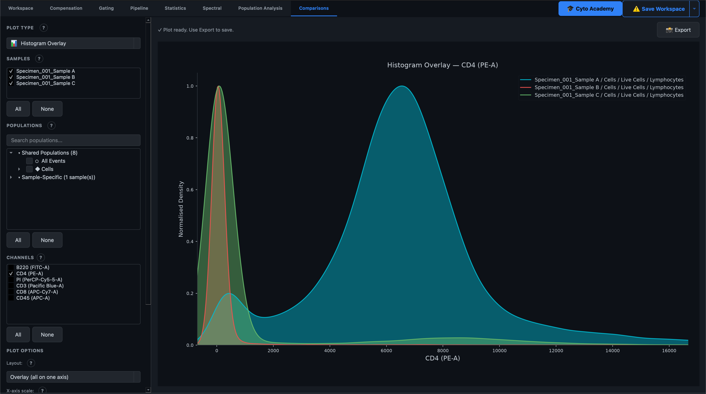
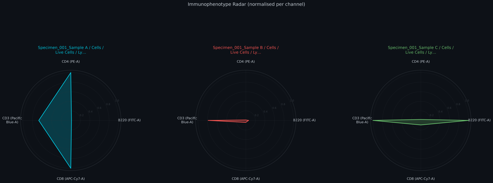

# Comparisons

The **Comparisons** tab is a dedicated workspace for putting multiple samples or populations side by side on one plot — answering questions a single gating plot can't, like "does this marker differ between treatment and control?" or "how does this population's phenotype change across timepoints?" It's built for cross-sample analysis specifically, rather than exploring a single sample's own gating hierarchy.

The tab has no ribbon toolbar; every control — plot type, sample and population selection, plot-specific options — lives in the left sidebar of the workspace itself.

## 1. Choosing a plot type

The **Plot Type** dropdown at the top of the sidebar selects one of five comparison views. Each plot type has its own constraints on how many samples/populations/channels it needs — the sidebar automatically adjusts (e.g. switching the sample list to single-select, or hiding the channel list) to only offer choices that plot type can actually use.

| Plot type | What it shows | Samples | Populations | Channels |
|---|---|---|---|---|
| 🎻 Violin Plot | The distribution of one channel across samples, side-by-side | Multiple | One per sample | Single |
| 🗺️ Channel Heatmap | A colour grid — rows = samples/populations, columns = channels, cell = median expression | Multiple | Multiple | Multiple |
| 🕷️ Radar Chart | Each population as a coloured polygon "fingerprint," one spoke per channel | Multiple | Multiple | Multiple |
| 📊 Histogram Overlay | Per-population distributions overlaid on one axis or stacked as a ridge plot | Multiple | Multiple | Single |
| 🌈 Pseudocolor Overlay | Several gated populations from one sample plotted together on one 2D axis | Single | Multiple | (own axis pickers) |

## 2. Selecting samples and populations

The shared sample/population selector works the same way as in the Statistics tab: check samples in the top list, then check populations from the **Shared Populations** (present under the same name across every checked sample) or **Sample-Specific** groups below it. For Violin and other "one population per sample" plot types, the selector switches to a per-sample radio pick instead of a checklist, since those plot types can only use one population from each sample.

## 3. Choosing channels

The **Channels** section is shown or hidden depending on the plot type — it's hidden entirely for Pseudocolor Overlay, which has its own X/Y axis channel pickers in its options panel instead. Violin and Histogram Overlay enforce a single checked channel (checking a new one automatically unchecks the previous); Heatmap and Radar allow any number of checked channels, since each one becomes a column or a spoke.

## 4. Plot-specific options

Each plot type has its own options panel below the channel list, swapped in automatically when you change plot type.

**Violin Plot** — orientation (vertical/horizontal), an optional box-and-whisker overlay showing median and IQR, and an option to overlay individual event points (capped at 500 per sample) for small populations where the violin shape alone isn't informative.

**Channel Heatmap** — the summary statistic per cell (Median, Mean, or Geometric Mean), a colour map (Red–Yellow–Blue, Viridis, Magma, Plasma, or Blues), whether each channel column is independently normalised to 0–1 (recommended — otherwise a high-intensity channel like SSC dominates the colour scale), and whether to print the raw value inside each cell.

**Radar Chart** — the statistic per spoke (Median or Mean), whether each spoke is independently normalised to 0–1 (recommended for the same reason as the heatmap — otherwise one high-magnitude channel makes every polygon look like a single spike), and the fill opacity of each population's polygon.

**Histogram Overlay** — layout (**Ridge**, a classic stacked waterfall plot with configurable overlap between panels, or **Overlay**, all populations alpha-blended on one shared axis), X-axis scale (Linear, Log₁₀, or Biexponential — the last two suited to flow cytometry's wide dynamic range and post-compensation negative values), a smooth KDE curve versus raw histogram bars (with a configurable bin count), line width, and a legend toggle for overlay mode. Both layouts accept any mix of samples and populations at once.

**Pseudocolor Overlay** — X and Y axis channel pickers (typically FSC/SSC for a classic scatter view, or two fluorescence channels), a toggle for whether the base "All Events" layer renders as a density-shaded pseudocolor cloud (matching the main gating canvas) or a flat grey scatter for faster rendering on very large samples, and an opacity slider for the overlaid populations.

## 5. Generating and reading the plot

Click **Generate Plot**. Rendering happens on a background thread, so a busy comparison across many samples doesn't freeze the interface — a thin progress bar appears above the results area while it works. Each sample or population gets a consistent colour from Comparisons' own palette, auto-assigned rather than manually picked, so colours stay consistent if you regenerate the same selection with different options.

## 6. Exporting

Once a plot is generated, **Export** in the toolbar saves it as PNG, PDF, or SVG at publication resolution (300 DPI). Changing the theme (light/dark) automatically re-renders the current plot with updated colours, so exported figures always match what's on screen.

!!! tip "Typical use cases"
    Use **Violin** or **Histogram Overlay** to compare a single marker's expression across treatment and control groups. Use **Heatmap** or **Radar** to compare the full multi-marker phenotype of several populations at a glance — organ or cell-type identity tends to jump out as a visibly different shape or colour pattern. Use **Pseudocolor Overlay** to sanity-check gate placement — confirming, for example, that a CD4+ gate and a CD8+ gate from the same sample don't visually overlap where they shouldn't.
